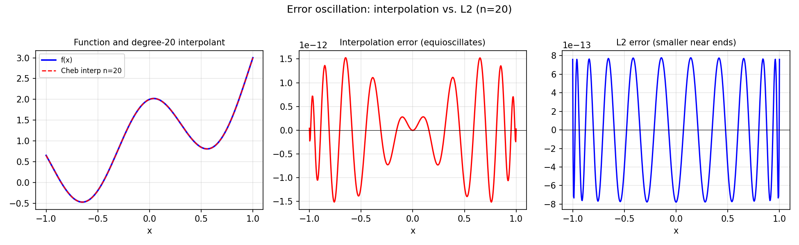

# Approximations and Oscillation of Error

*Mohsin Javed, October 2013*

[Original MATLAB Chebfun example](https://www.chebfun.org/examples/approx/OscError.html)

## How errors oscillate

- **Interpolation** at Chebyshev points: the error equioscillates between $n+2$
  extreme values (Chebyshev equioscillation theorem).
- **L2 (polyfit)**: the error is smaller on average but larger in some places;
  it does NOT equioscillate.

```python
import chebfunjax as cj
import jax.numpy as jnp
import numpy as np

def f_func(x): return jnp.exp(x) + jnp.cos(5.0*x)
f = cj.chebfun(f_func)
n = 20

# L2 best approximation
p_L2 = f.polyfit(n)

# Chebyshev interpolant (degree n)
cheb_nodes = np.cos(np.pi * np.arange(n+1) / n)
y_nodes = np.array([float(f(jnp.array(x))) for x in cheb_nodes])
coeffs = np.polyfit(cheb_nodes, y_nodes, n)

xx = np.linspace(-1, 1, 500)
f_true = np.array([float(f(jnp.array(x))) for x in xx])
err_interp = np.polyval(coeffs, xx) - f_true
err_L2 = np.array([float(p_L2(jnp.array(x))) for x in xx]) - f_true

print(f"Interp max err: {np.max(np.abs(err_interp)):.3e}")
print(f"L2    max err: {np.max(np.abs(err_L2)):.3e}")
```



