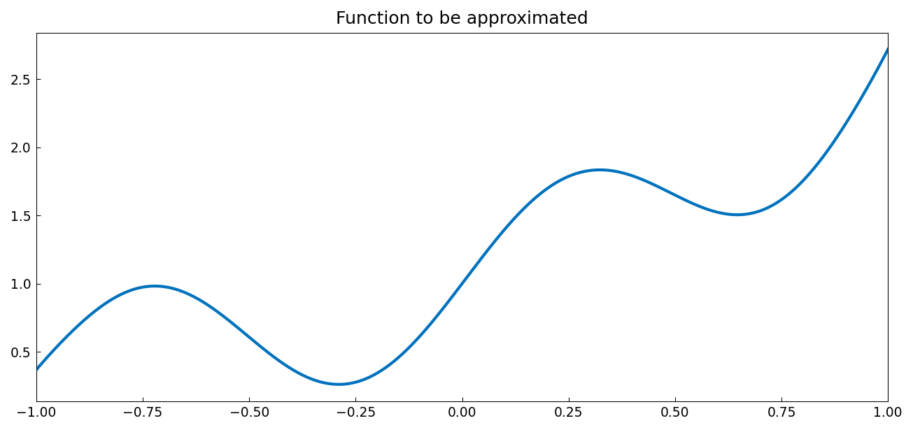
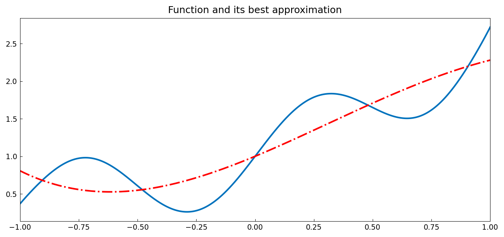
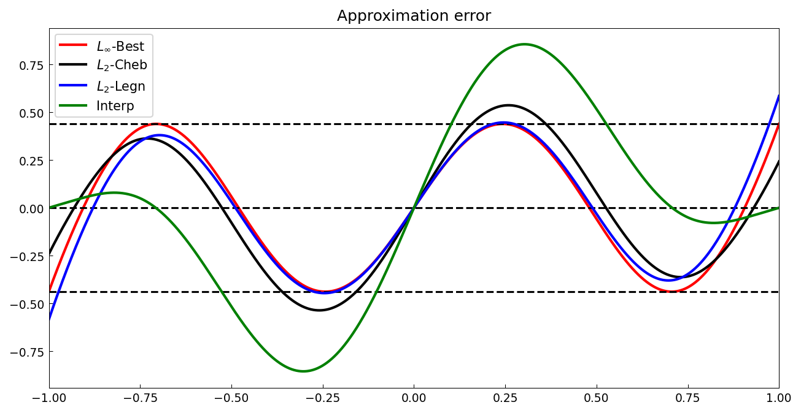

# Approximations and oscillation of error

*Mohsin Javed, October 2013*

[Original MATLAB Chebfun example](https://www.chebfun.org/examples/approx/OscError.html)

(Chebfun example approx/OscError.m)

## Introduction

Let us approximate a continuous function $f$ defined on $[-1,1]$ in
several different ways:

```python
import jax.numpy as jnp
import chebfunjax as cj

f = cj.chebfun(lambda x: jnp.exp(x) + 0.5*jnp.sin(2*jnp.pi*x), n=10)
```



## Best approximation in the $\infty$-norm

The existence and uniqueness of the best minimax approximation of $f$
in the space of polynomials of degree up to $n$ is well known.  The
best degree $n$ approximation is characterized by the equioscillation
of the error between at least $n+2$ extrema; the error consequently
changes sign at least $n+1$ times [1].  Chebfun's `minimax` command
finds this polynomial for $n=4$:

```python
from chebfunjax.utils.minimax import minimax
res = minimax(lambda x: f(x), 4)
```



## Comparing the error curves

We can see that the minimax error (red) equioscillates $n+2$ times with
$n+1$ sign changes.  The error curve of the best weighted $L_2$
approximation (a truncated Chebyshev series, black) also changes sign
at least $n+1$ times [2] but does not equioscillate; likewise the
Legendre least-squares approximation (blue, via `polyfit`) and
interpolation in $n+1$ Chebyshev points (green):



## References

1. L. N. Trefethen, _Approximation Theory and Approximation Practice_,
   SIAM, 2013.

2. M. Javed and L. N. Trefethen, Euler-Maclaurin and Gregory
   interpolants, in preparation.

---

*Replicated with [chebfunjax](https://github.com/ma-gilles/chebfunjax); original
example copyright The University of Oxford and The Chebfun Developers.*
