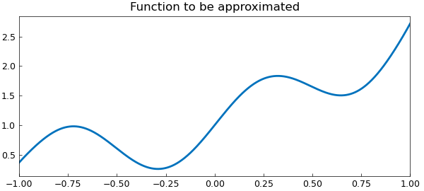
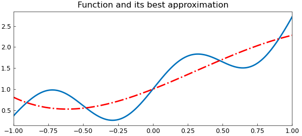
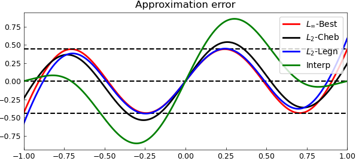
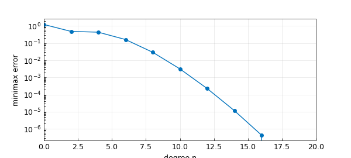
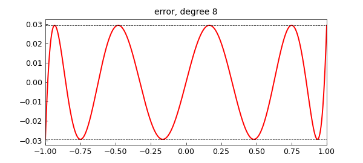
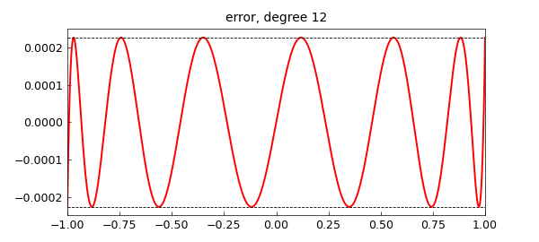

# Approximations and oscillation of error

*Mohsin Javed, October 2013*

[Original MATLAB Chebfun example](https://www.chebfun.org/examples/approx/OscError.html)

Python translation: [`examples/approx/osc_error.py`](https://github.com/ma-gilles/chebfunjax/blob/main/examples/approx/osc_error.py)

## Introduction

Let us approximate a continuous function $f$ defined on $[-1,1]$ in several different ways.

```matlab
f = chebfun( @(x) exp(x) + .5*sin(2*pi*x), 10);
LW = 'linewidth'; lw = 2; FS = 'fontsize'; fs = 12;
plot(f, LW, lw),
title( 'Function to be approximated', FS, fs), hold on
```



## Best Approximation in $\infty$-Norm

The existence and uniqueness of the the best minimax approximation of $f$ in the space of polynomials of degree up to $n$ is well known. The best degree $n$ approximation is characterized by the equioscillation of the error between at least $n+2$ extrema. The error consequently changes sign at least $n+1$ times [1]. Let us suppose we want to find the degree $n$ best approximation of this function. Chebfun's `remez` command can be used to find this polynomial:

```matlab
n = 4;
p = remez(f, n);
plot(p, 'r-.', LW, lw)
title('Function and its best approximation', FS, fs), hold off
```



```matlab
clf, hold on
h1 = plot(f - p, 'r', LW, lw);
title('Approximation error', FS, fs)
maxError = norm(f-p, inf);
plot( [-1, 1], [maxError maxError], 'k--', LW, 1.5)
plot( [-1, 1], -[maxError maxError], 'k--', LW, 1.5)
plot( [-1, 1], [0 0], 'k--', LW, 1.5), box on
```



We can see that the error equioscillates $n+2$ times with $n+1$ sign changes.

## Best Weighted $L_2$ Approximation

It is also interesting to note that the error curve of the best weighted $L_2$ approximation of a continuous function by a degree $n$ polynomial has the same oscillation property. The error curve is guaranteed to change sign at least $n+1$ times [2], however, in this case, the error curve does not generally equioscillate. For the same function, we now construct a degree $n$ approximation by Chebyshev polynomials. This can be done in Chebfun using the `'trunc'` option, since best $L_2$ approximations are simply given by truncated Fourier series (a Chebyshev-Fourier series in this case):

```matlab
fn = chebfun( @(x) f(x), 'trunc', n + 1);
h2 = plot(f - fn, 'k', LW, lw);
```



## Best $L_2$ Approximation

We can also think of approximating the same function using Legendre polynomials. In this case, we can use Chebfun's `polyfit` command to generate the best $L_2$ approximating polynomial. This is just the truncated Fourier-Legendre series expansion of the function $f$. The error curve again behaves as expected:

```matlab
pLn = polyfit(f, n);
h3 = plot(f - pLn, 'b', LW, lw);
```



## Interpolation

The degree $n$ interpolant of a function by definition hits the function normally at least $n+1$ times, and hence the error curve again has at least $n+1$ sign changes.

```matlab
pn = chebfun( @(x) f(x), n + 1);
h4 = plot( f - pn, 'g', LW, lw); hold off
legend( [h1(:,1), h2(:,1), h3(:,1), h4(:,1)], ...
    {'L_\infty-Best', 'L_2-Cheb', 'L_2-Legn', 'Interp'})
```



Notice that since Chebfun normally uses Chebyshev points of the second kind for interpolation, which include the end points $-1$ and $1$, the error curve will always have zeros at $-1$ and $1$. You will get a different effect however if you run this example in a mode using Chebyshev points of the first kind rather than the second kind.

## References

1. L. N. Trefethen, *Approximation Theory and Approximation Practice*, SIAM, 2013.
2. P. J. Davis, *Interpolation and Approximation*, Blaisdell Publishing Company, 1965.

---

*Translated with [chebfunjax](https://github.com/ma-gilles/chebfunjax); prose and MATLAB code from the original example, copyright The University of Oxford and The Chebfun Developers.  Printed outputs and figures are chebfunjax's.*
