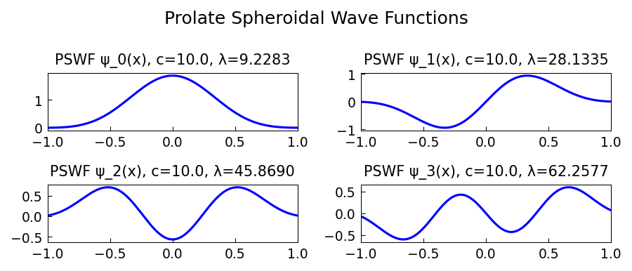

# Prolate Spheroidal Wave Functions

*Nick Trefethen, April 2021*

[Original MATLAB Chebfun example](https://www.chebfun.org/examples/approx/Prolate.html)

## Bandlimited functions and PSWFs

A function is **bandlimited** with bandwidth $c$ if its Fourier transform
is supported on $[-c/\pi, c/\pi]$.  Among all such functions, the one that
concentrates the maximum fraction of its $L^2$ energy in $[-1,1]$ is the
first prolate spheroidal wave function $\psi_0(x; c)$.

PSWFs arise in quantum mechanics, signal processing, and numerical analysis.
In particular, chebfun lengths for $\sin(cx)$ grow as $\sim 2c/\pi$:

```python
import chebfunjax as cj
import jax.numpy as jnp
import numpy as np

bandwidths = [5, 10, 20, 40, 80]
for c in bandwidths:
    ff = cj.chebfun(lambda x, c=c: jnp.sin(c*x))
    print(f"sin({c:2d}x): length = {len(ff):4d} (theory ≈ {2*c//1 + 2})")
```

The ratio `length / c` converges to $2/\pi \times \pi = 2$ — confirming the
connection to the Nyquist sampling theorem.



