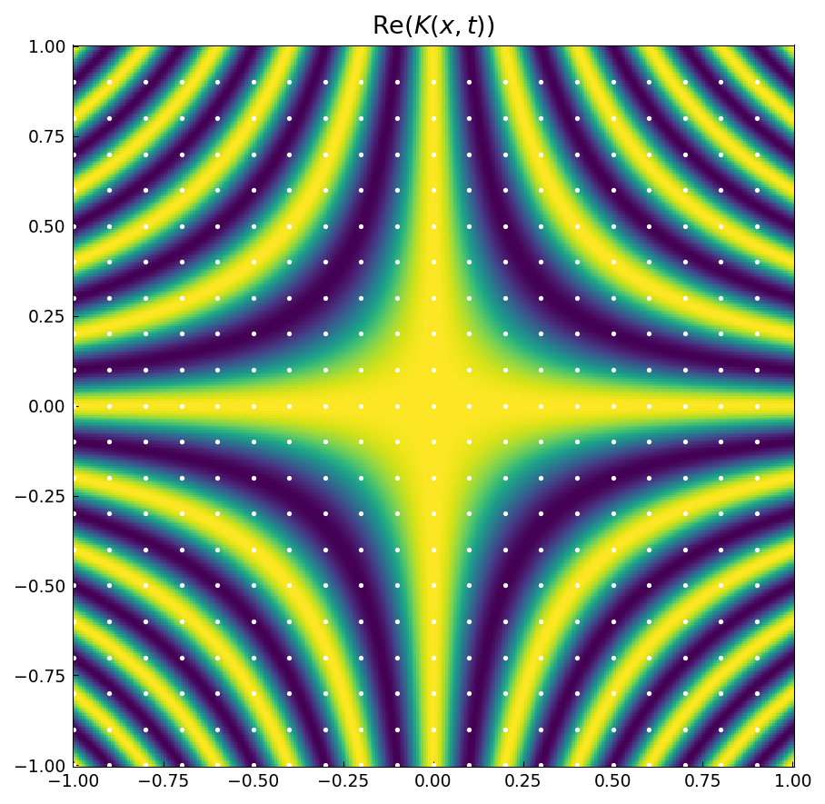
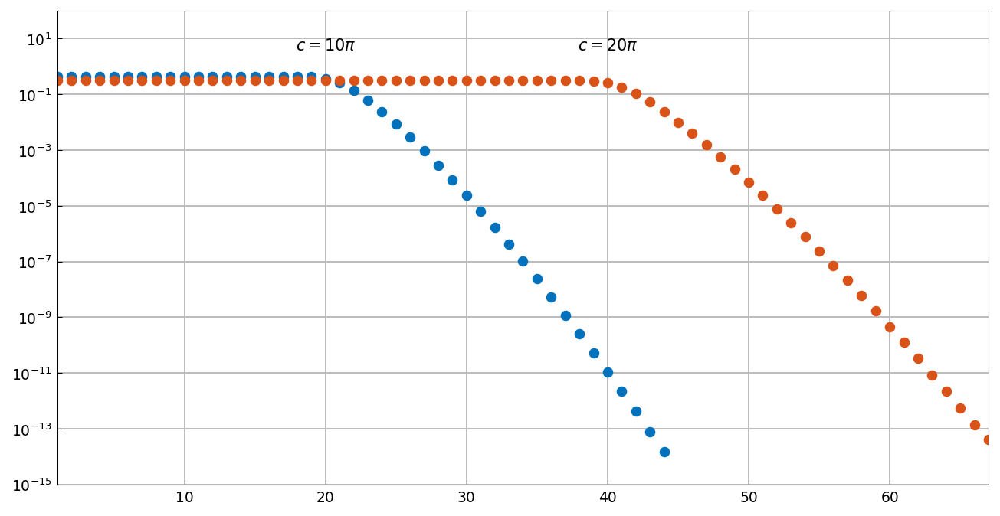
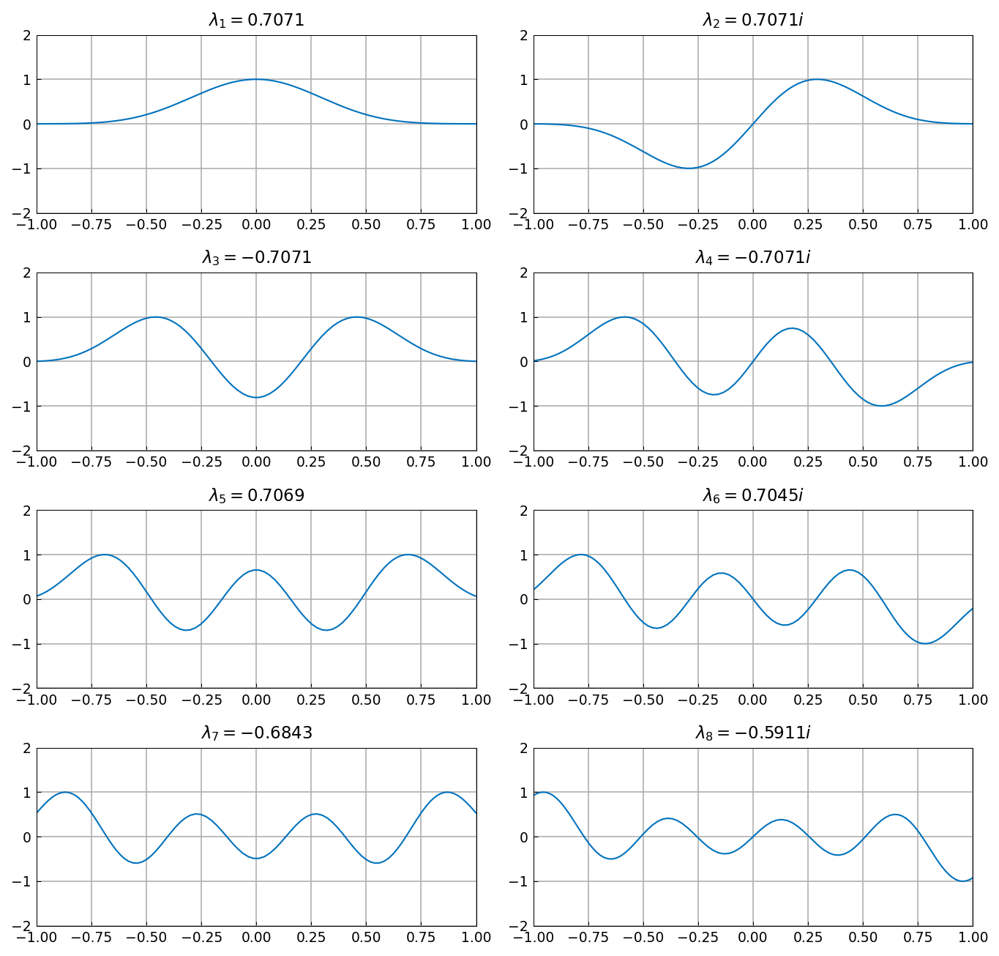
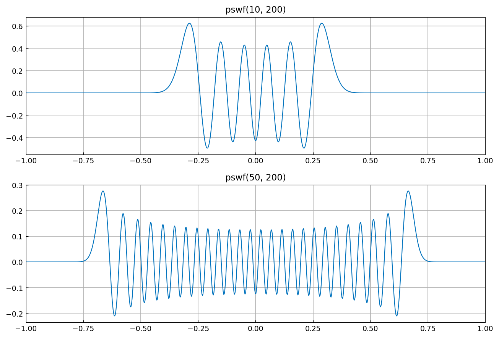

# Prolate spheroidal wave functions

*Nick Trefethen, April 2021*

[Original MATLAB Chebfun example](https://www.chebfun.org/examples/approx/Prolate.html)

(Chebfun example approx/Prolate.m)

Sometimes a beautiful, fundamental idea is held back by a clunky name.
Prolate Spheroidal Wave Functions (PSWFs) are an example.  You'd never
guess from this name that we're talking about the eigenfunctions of the
continuous analogue of the famous Discrete Fourier Transform (DFT)
matrix.

With $c$ a positive constant, consider the bivariate function

$$ K(x,t) = e^{icxt}, \quad -1\le x,t \le 1. $$

If $c = N\pi$ and we sample $K$ on the grid $t=\mu/N$, $x=\nu/N$ for
$-N\le\mu,\nu<N$, we get the $2N\times 2N$ DFT matrix (up to a
permutation).  It is $\sqrt{2N}$ times a unitary matrix and of rank
exactly $2c/\pi$:

```python
import numpy as np
import jax.numpy as jnp
import chebfunjax as cj

N = 10; c = N*np.pi
K10 = cj.chebfun2(lambda x, t: jnp.exp(1j*c*x*t))
xx = np.arange(-N, N)/N
A = np.asarray(K10(jnp.asarray(xx[:, None]), jnp.asarray(xx[None, :])))
```
```
condA =
   1.000000000000060
rankA =
    20
```

(Published: `condA = 1.000000000000002`, `rankA = 20`.)  Now let's look
at the continuous bivariate function; white dots mark the sample points
above:



We regard $K$ as the kernel of an integral operator on $L^2([-1,1])$.
With the newly ported `Chebfun2.eig` we can compute its spectrum.  The
absolute values $\lambda_j$ of the eigenvalues for $j<2c/\pi$ are all
approximately equal to $\sqrt{2\pi/c}$, whereas for $j>2c/\pi$ they
decrease super-exponentially:



It's worth looking at the numbers, which show the leading eigenvalue
absolute values matching $\sqrt{2\pi/c} = 1/\sqrt 5$ to machine
precision:

```
lamabs =
   0.447213595499959
   0.447213595499959
   0.447213595499959
   0.447213595499958
   0.447213595499958
   0.447213595499958
   0.447213595499958
   0.447213595499931
   0.447213595499293
   0.447213595485795
   0.447213595238870
   0.447213591309931
   0.447213536711058
   0.447212872984998
```

(Digit-for-digit with the published list apart from last-digit
rounding.)  In words, the set of functions on $[-1,1]$ bandlimited to
wave numbers $[-c,c]$ has numerical dimension approximately $2c/\pi$ —
the discovery of Slepian, Pollak, and Landau at Bell Labs [1,2,3].

Here are the first eight eigenfunctions for $c = 4\pi$; note that each
is either even or odd:



Chebfun's `pswf` command computes prolate spheroidal wave functions
directly, for larger $c$ too:



## References

1. D. Slepian and H. O. Pollak, Prolate spheroidal wave functions,
   Fourier analysis and uncertainty — I, _Bell Syst. Tech. J._, 40
   (1961), 43-63.

2. H. J. Landau and H. O. Pollak, ... — II, _Bell Syst. Tech. J._, 40
   (1961), 65-84.

3. H. J. Landau and H. O. Pollak, ... — III, _Bell Syst. Tech. J._, 41
   (1962), 1295-1336.

---

*Replicated with [chebfunjax](https://github.com/ma-gilles/chebfunjax); original
example copyright The University of Oxford and The Chebfun Developers.*
