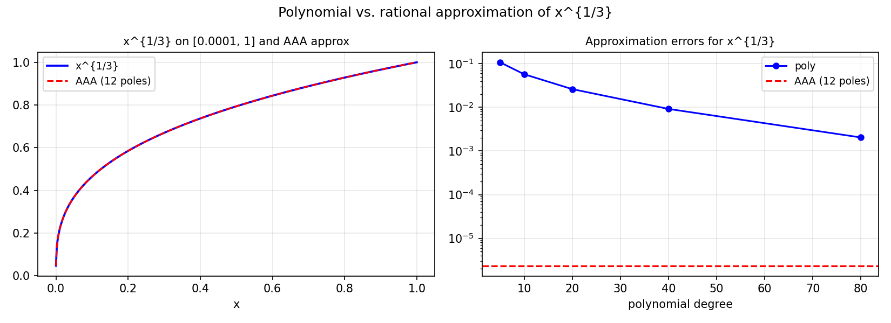

# Approximating the pth Root by Composite Rational Functions

*Evan S. Gawlik and Yuji Nakatsukasa, October 2019*

[Original MATLAB Chebfun example](https://www.chebfun.org/examples/approx/PthComposite.html)

## Composite rational approximation

For approximating $x^{1/p}$ on $[0,1]$, a single rational function of type
$(n,n)$ achieves accuracy $O(\exp(-C\sqrt{n}))$ (root-exponential). Composite
(iterated) rational functions can do much better — super-exponentially fast.

The key idea: if $r$ approximates $x^{1/p}$ well, then $r(r(x))$ approximates
$x^{1/p^2}$, and so on.

```python
from chebfunjax.utils.aaa import aaa
import jax.numpy as jnp
import numpy as np

p = 3
delta = 1e-4
xs = jnp.linspace(delta, 1.0, 300)
ys = xs**(1.0/p)
r, pol, *_ = aaa(ys, xs)
print(f"AAA type: ({len(pol)-1}, {len(pol)-1})")

test = np.linspace(delta, 1.0, 500)
err = np.max(np.abs([float(r(jnp.array(x))) for x in test] - test**(1/p)))
print(f"Max error: {err:.2e}")
```



