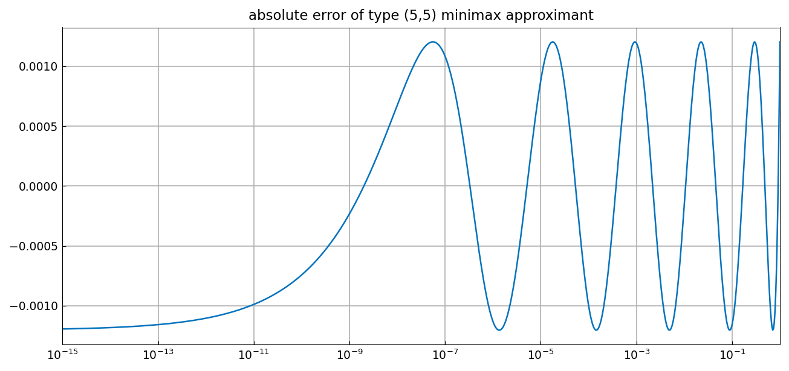
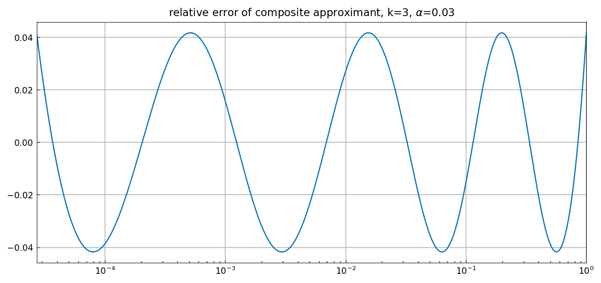
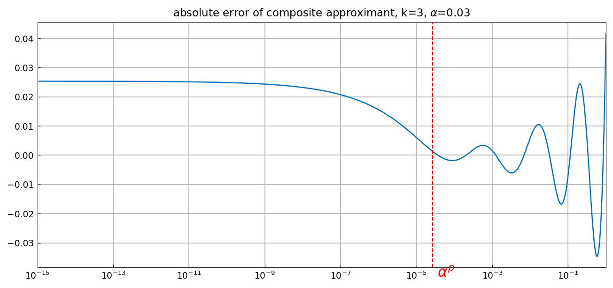
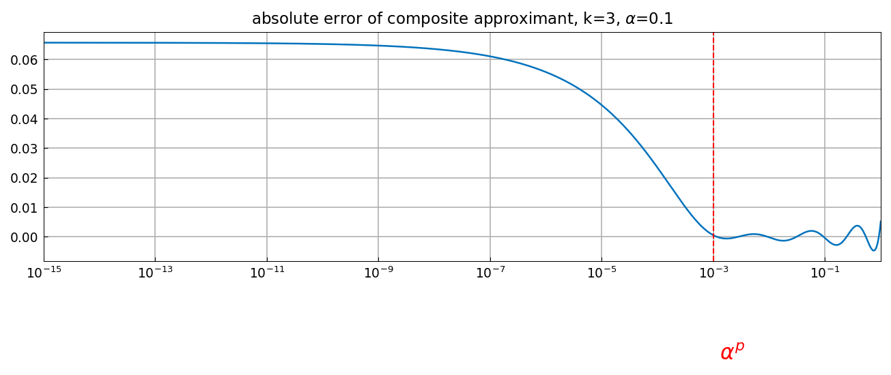
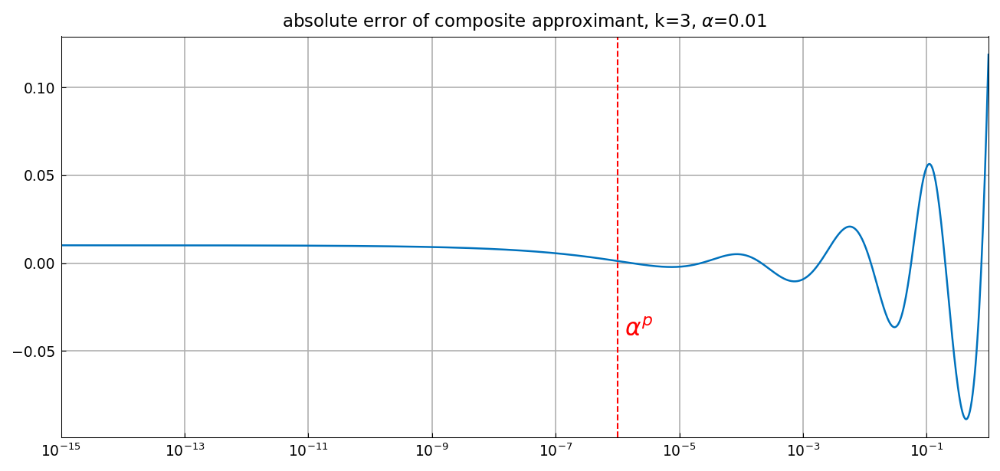
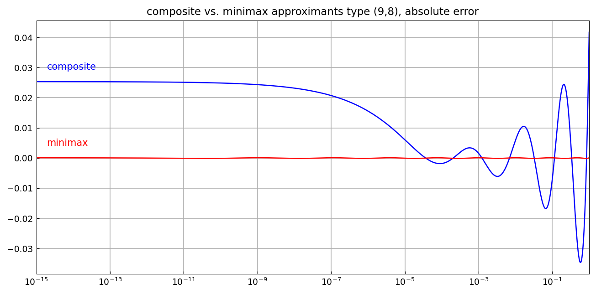
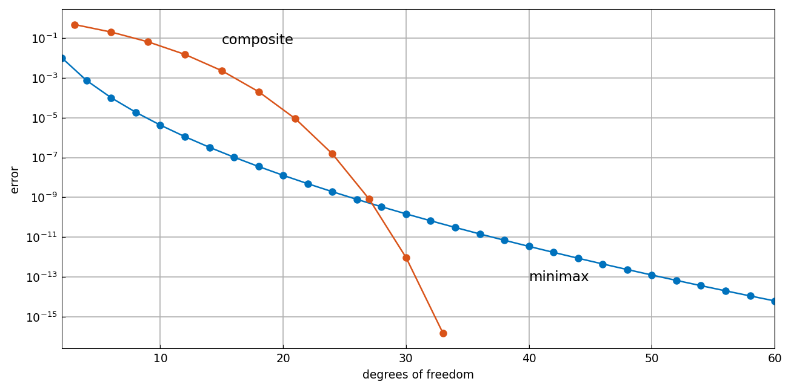

# Approximating the pth root by composite rational functions

*Evan S. Gawlik and Yuji Nakatsukasa, October 2019*

[Original MATLAB Chebfun example](https://www.chebfun.org/examples/approx/PthComposite.html)

(Chebfun example approx/PthComposite.m)

## Best rational approximation to the pth root

A landmark result of rational approximation theory states that the pth
root $x^{1/p}$ on $[0,1]$ can be approximated by type $(n,n)$ rational
functions with root-exponential accuracy:

$$\max_{x \in [0,1]} |r_n(x)-x^{1/p}| \sim
4^{1+1/p}\sin(\pi/p)\exp(-2\pi\sqrt{n/p}),$$

where the constants were worked out by Stahl [3].  For example, here is
the error curve of the minimax rational approximant of type $(5,5)$ to
the cube root (err $= 1.20\times 10^{-3}$), with its equioscillation at
$5+5+2=12$ points:

```python
from chebfunjax.utils.minimax import minimax
r = minimax(lambda x: x**(1/3), 5, rational=True, denom=5,
            domain=(0.0, 1.0))
```



## Approximation by composite rational functions

In [1], Gawlik examined rational approximations of $x^{1/p}$ obtained
by composing rational functions of lower degree, via the recursion

$$ f_{k+1}(x) = \frac{1}{p}\left( (p-1)\mu_k f_k(x) +
\frac{x}{\mu_k^{p-1} f_k(x)^{p-1}} \right), \quad f_0(x) = 1. $$

The scaled function $\widetilde{f}_k = 2\alpha_k f_k/(1+\alpha_k)$ has
relative error equioscillating at $2^k+1$ points on $[\alpha^p,1]$:



Instead of the relative error, we might be interested in the absolute
error.  Here is a plot including much smaller values of $x$ — the error
oscillates with growing amplitude on $[\alpha^p,1]$ and stays bounded
on $[0,\alpha^p]$:



The picture looks quite different with a larger $\alpha$:



And with a smaller $\alpha$:



The composite approximants are of type $(9,8)$.  Here is a comparison
with the type $(9,8)$ minimax approximant (err $= 1.11\times 10^{-4}$):



It can be shown that with respect to the degree, the composite rational
approximant converges almost "pth root exponentially."  But composite
approximants are still interesting, because they can be generated using
very few parameters — only $O(k)$ parameters express a rational
function of degree $3^k$.  Here is a convergence comparison with
respect to the degrees of freedom; with double-exponential convergence
in $k$, composite rational approximants eventually outperform minimax:



## References

1. E. S. Gawlik, Zolotarev iterations for the matrix square root, _SIAM
   J. Matrix Anal. Appl._, 40 (2019), 696-719.

2. E. S. Gawlik and Y. Nakatsukasa, Approximating the pth root by
   composite rational functions, arXiv:1906.11326.

3. H. Stahl, Best uniform rational approximation of $x^\alpha$ on
   $[0,1]$, _Acta Math._, 190 (2003), 241-306.

---

*Replicated with [chebfunjax](https://github.com/ma-gilles/chebfunjax); original
example copyright The University of Oxford and The Chebfun Developers.*
