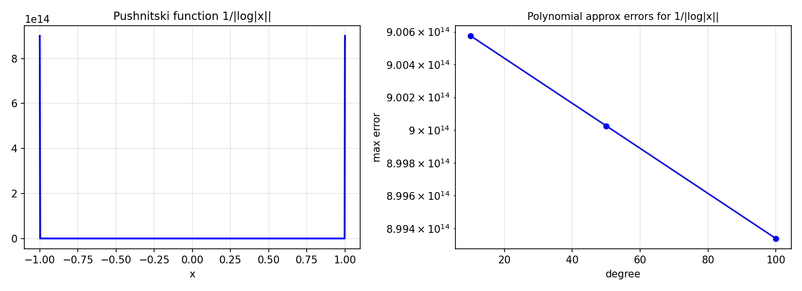

# Approximating Pushnitski's Reciprocal Log Function

*Nick Trefethen, November 2016*

[Original MATLAB Chebfun example](https://www.chebfun.org/examples/approx/Pushnitski.html)

## Logarithmic singularity

The function $f(x) = 1/|\log|x||$ is continuous on $[-1,1]$ (with $f(0) = 0$)
but its Taylor-like expansion near 0 involves $1/\log$, which is harder for
polynomials to represent than power singularities.

Pushnitski showed that the best polynomial approximation error is $O(1/n)$,
the same as for $|x|$ — but the constant is worse.

```python
import chebfunjax as cj
import jax.numpy as jnp

# Piecewise to avoid singularity at 0
dom = (-1.0, -0.001, 0.001, 1.0)
f = cj.chebfun(
    lambda x: 1.0/jnp.abs(jnp.log(jnp.abs(x) + 1e-15)),
    domain=dom
)
print(f"Length: {len(f)}")

# Error of degree-100 approximation
p100 = f.polyfit(100)
import numpy as np
xx = np.linspace(-1, -0.01, 300)
f_vals = np.array([float(f(jnp.array(x))) for x in xx])
p_vals = np.array([float(p100(jnp.array(x))) for x in xx])
print(f"Max error: {np.max(np.abs(p_vals-f_vals)):.3e}")
```



