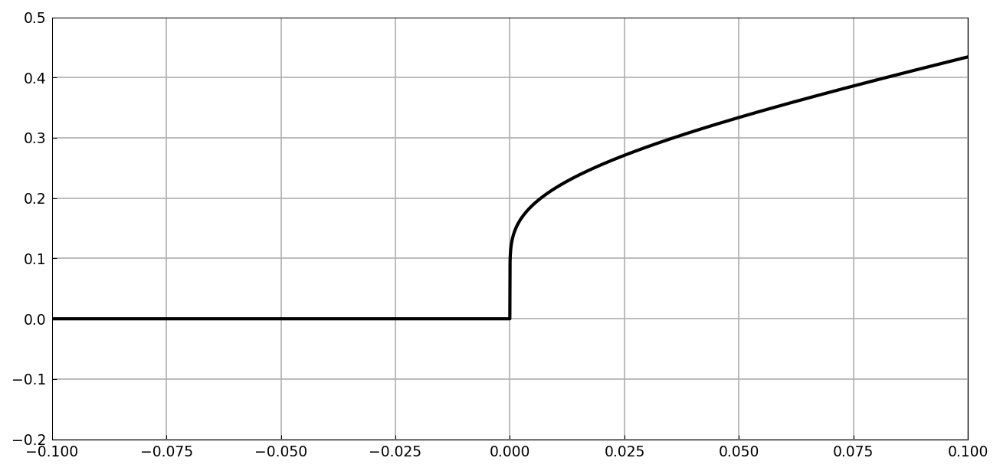
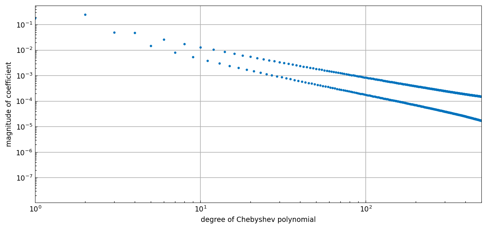
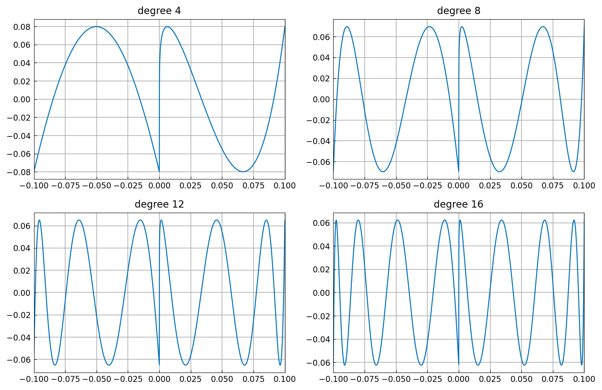
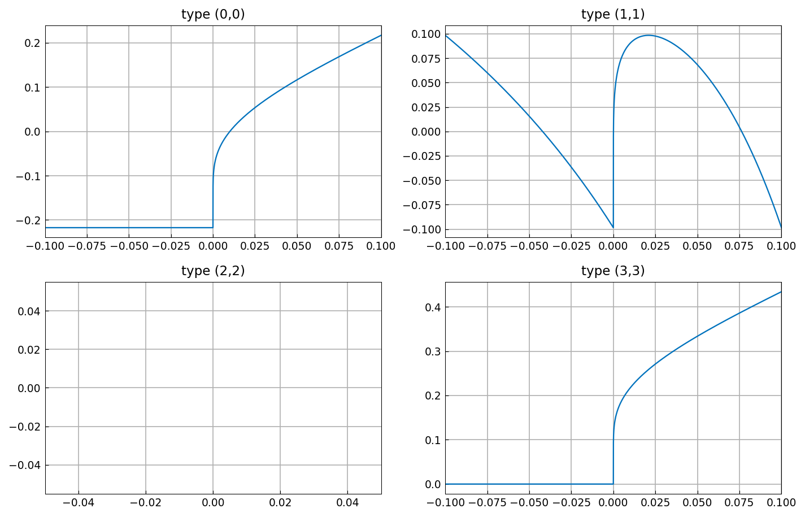
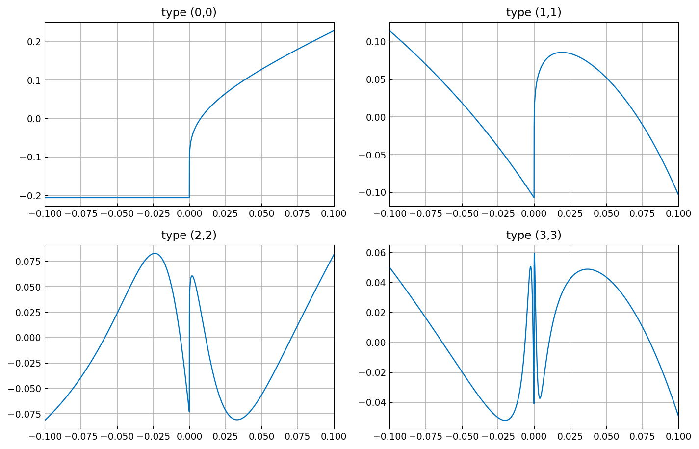

# Approximating Pushnitski's reciprocal log function

*Nick Trefethen, November 2016*

[Original MATLAB Chebfun example](https://www.chebfun.org/examples/approx/Pushnitski.html)

(Chebfun example approx/Pushnitski.m)

The function $|x|$ can be approximated with accuracy $O(1/n)$ by degree
$n$ polynomials on $[-1,1]$ but accuracy $O(\exp(-C\sqrt n))$ by type
$(n,n)$ rationals.  In a lecture at Oxford on 8 November, Alexander
Pushnitski presented some striking theorems concerning much more
difficult functions involving $1/\log x$.  Roughly speaking polynomials
can achieve accuracy $1/\log n$ whereas rationals are closer to $1/n$.

As a concrete example, consider the function that takes the value $0$
for $x\in [-.1,0]$ and $-1/\log x$ for $x\in [0,.1]$:

```python
import numpy as np
import jax.numpy as jnp
import chebfunjax as cj

def fop(x):
    ax = jnp.where(x > 0, x, 1e-300)
    return jnp.where(x > 0, -1.0/jnp.log(ax), 0.0)

f = cj.chebfun(fop, domain=[-0.1, 0.0, 0.1])
```



The function is so steep that it is nearly a step at $x=0$.  We know
that the Chebyshev coefficients of a function with a jump discontinuity
decrease at the rate $O(1/n)$.  This function is almost a step
discontinuity, and the Chebyshev coefficients decrease almost as
slowly, at a rate roughly $O(1/n\log n)$:

```python
f1000 = cj.chebfun(fop, domain=(-0.1, 0.1), n=1000)
```



Here are some polynomial approximations to $f$ (degrees 4, 8, 12, 16):



These converge very slowly, and that could easily be proved.  For $p$
to approximate $f$ to accuracy $\epsilon$, its derivative would have to
be of size at least $\exp(C/\epsilon)$.  From Markov's inequality it
will follow that $\epsilon$ can decrease no faster than approximately
$O(1/\log n)$ as $n\to\infty$.

Here are some rational approximations (types $(0,0)$ through $(3,3)$).
The convergence is probably $O(1/n)$, but we are far from seeing that:



What about CF (=AAK) approximation, which as it happens is the method
used by Pushnitski for his proofs?  It gets in the ballpark:



## References

1. A. Pushnitski and D. Yafaev, Best rational approximation of functions
   with logarithmic singularities, _Constructive Approximation_, 2016.

---

*Replicated with [chebfunjax](https://github.com/ma-gilles/chebfunjax); original
example copyright The University of Oxford and The Chebfun Developers.*
