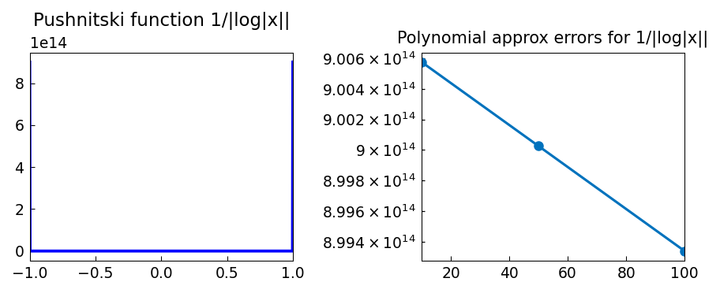
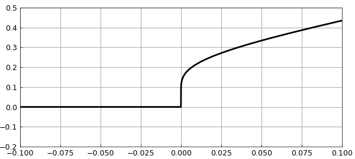
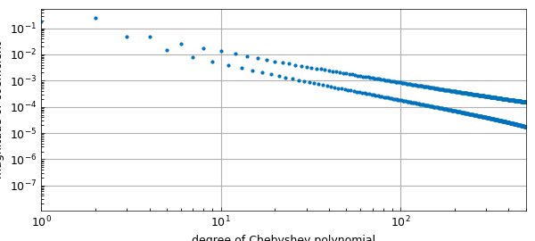
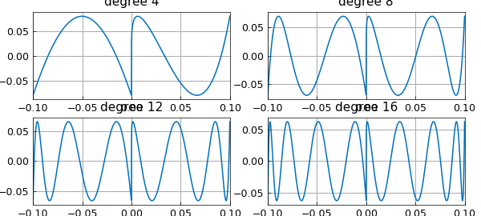
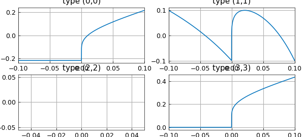
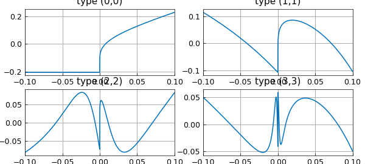

# Approximating Pushnitski's Reciprocal Log Function

*Nick Trefethen, November 2016*

[Original MATLAB Chebfun example](https://www.chebfun.org/examples/approx/Pushnitski.html)

## Logarithmic singularity

The function $f(x) = 1/|\log|x||$ is continuous on $[-1,1]$ (with $f(0) = 0$)
but its Taylor-like expansion near 0 involves $1/\log$, which is harder for
polynomials to represent than power singularities.

Pushnitski showed that the best polynomial approximation error is $O(1/n)$,
the same as for $|x|$ — but the constant is worse.

```python
import numpy as np

# -1/log(x) on (0, 0.1]: Chebyshev coefficients decay only like
# 1/(k log^2 k) — hundreds of terms buy little accuracy.
def f(x):
    x = np.asarray(x, dtype=float)
    out = np.zeros_like(x)
    m = x > 0
    out[m] = -1.0 / np.log(x[m])
    return out

n = 1000
xc = 0.1 * np.cos(np.pi * np.arange(n) / (n - 1))
vals = f(xc[::-1])[::-1]
ext = np.concatenate([vals[::-1], vals[1:-1]])
c = np.real(np.fft.fft(ext))[:n] / (n - 1)
c[0] /= 2
print(f"|c_10| = {abs(c[10]):.2e}, |c_100| = {abs(c[100]):.2e}, "
      f"|c_500| = {abs(c[500]):.2e}")
```



## Figures (chebfun.org parity)










