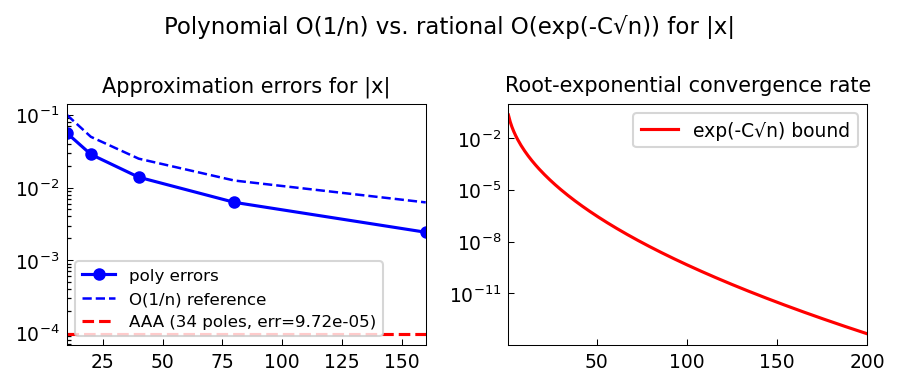

# Rational Approximation of abs(x) with Minimax

*Silviu Filip, Yuji Nakatsukasa, and Nick Trefethen, May 2017*

[Original MATLAB Chebfun example](https://www.chebfun.org/examples/approx/RationalAbsx.html)

## Newman's theorem

Newman (1964) showed that the best type $(n,n)$ rational approximation to $|x|$
on $[-1,1]$ achieves accuracy $O(\exp(-C\sqrt{n}))$, far better than the
polynomial $O(1/n)$.

The constant is approximately $C \approx \pi/\sqrt{2}$ (though the exact value
of the asymptotic constant was refined later).

```python
from chebfunjax.utils.aaa import aaa
import jax.numpy as jnp
import numpy as np

xs = jnp.linspace(-1.0, 1.0, 400)
ys = jnp.abs(xs)
r, pol, *_ = aaa(ys, xs)
xx = np.linspace(-1, 1, 600)
err = np.max(np.abs([float(r(jnp.array(x))) for x in xx] - np.abs(xx)))
print(f"AAA ({len(pol)} poles): max err = {err:.3e}")

# Compare: polynomial approximation
import chebfunjax as cj
f = cj.chebfun(jnp.abs)
for n in [10, 20, 40, 80]:
    pn = f.polyfit(n)
    pn_err = max(abs(float(pn(jnp.array(x))) - abs(float(x)))
                 for x in np.linspace(-1,1,200))
    print(f"poly deg {n:3d}: max err = {pn_err:.3e}")
```



