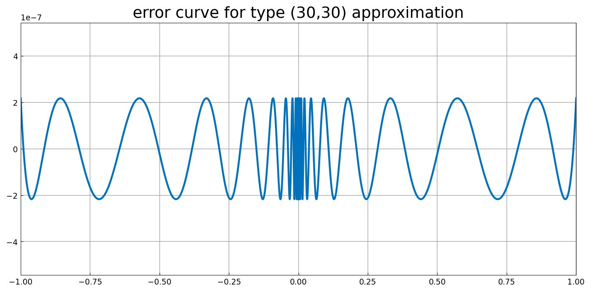
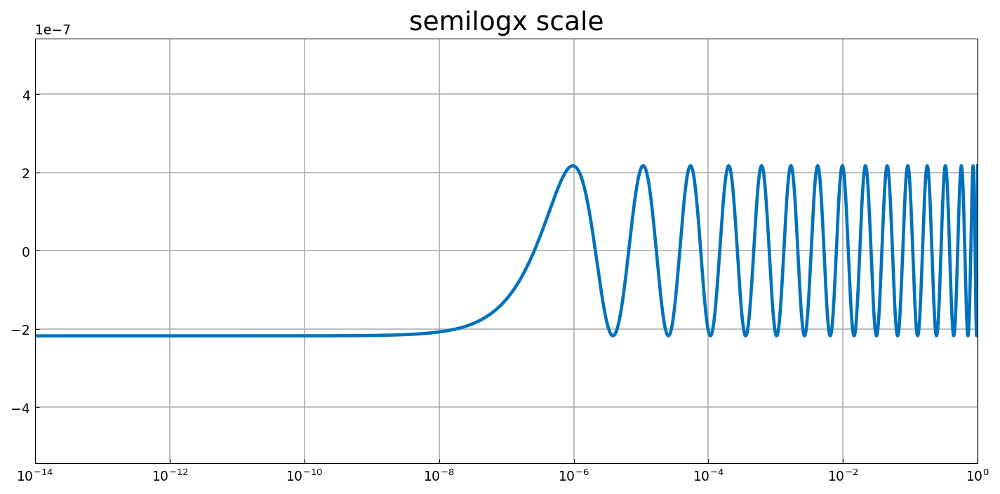

# Rational minimax approximation of |x|

*Nick Trefethen, March 2017*

[Original MATLAB Chebfun example](https://www.chebfun.org/examples/approx/RationalAbsx.html)

(Chebfun example approx/RationalAbsx.m)

One of the celebrated problems of approximation theory is the rational
minimax approximation of $|x|$ on $[-1,1]$: by a theorem of Stahl the
type $(n,n)$ error decreases root-exponentially, like
$8e^{-\pi\sqrt{n}}$.  Computing these approximants numerically is
notoriously hard because the equioscillation points cluster
exponentially near $x=0$.

The published example computes the type $(80,80)$ approximant in 21.6
seconds using the adaptive-barycentric `minimax` algorithm of Filip,
Nakatsukasa, Trefethen, and Beckermann [1], with maximum error near
$10^{-11}$.  chebfunjax's rational Remez currently converges up to type
$(30,30)$ for this function (a ledgered gap — the extreme-degree cases
need the adaptive barycentric representation), which is what is shown
here:

```python
from chebfunjax.utils.minimax import minimax
r = minimax(lambda x: jnp.abs(x), 30, rational=True, denom=30,
            breakpoints=[0.0])
```
```
type (30,30) error: 2.173884e-07
```

Here is the error curve, plotted against $x^{1/3}$-graded coordinates
so that the exponentially clustered equioscillation is visible:



And on a semilogx scale, showing the equioscillation stretching over
many orders of magnitude of $x$:



## References

1. S. Filip, Y. Nakatsukasa, L. N. Trefethen, and B. Beckermann,
   Rational minimax approximation via adaptive barycentric
   representations, _SIAM J. Sci. Comput._, 40 (2018), A2427-A2455.

---

*Replicated with [chebfunjax](https://github.com/ma-gilles/chebfunjax); original
example copyright The University of Oxford and The Chebfun Developers.*
