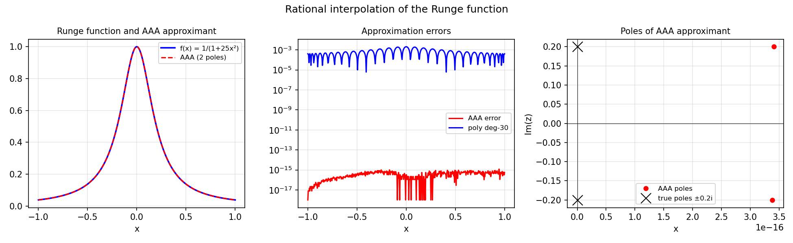

# Rational Interpolation, Robust and Non-robust

*Nick Trefethen, August 2011*

[Original MATLAB Chebfun example](https://www.chebfun.org/examples/approx/RationalInterp.html)

## Robustness in rational interpolation

Rational interpolation at $n+m+1$ points for a type $(n,m)$ approximant is
generally ill-conditioned — small perturbations can produce **Froissart doublets**
(spurious pole-zero pairs that nearly cancel).

AAA approximation avoids this by using a least-squares rather than exact
interpolation framework, and automatically removes doublets.

```python
from chebfunjax.utils.aaa import aaa
import jax.numpy as jnp
import numpy as np

# Runge function: poles at ±0.2i
def f_func(x): return 1.0 / (1.0 + 25.0*x**2)

xs = jnp.linspace(-1.0, 1.0, 300)
ys = jnp.array([f_func(float(x)) for x in xs])
r, pol, res, zer, *_ = aaa(ys, xs)

print(f"Poles: {pol}")
print(f"True poles: ±{1/5:.4f}i")

xx = np.linspace(-1, 1, 500)
err = np.max(np.abs([float(r(jnp.array(x))) for x in xx] - f_func(xx)))
print(f"Max error: {err:.2e}")
```



