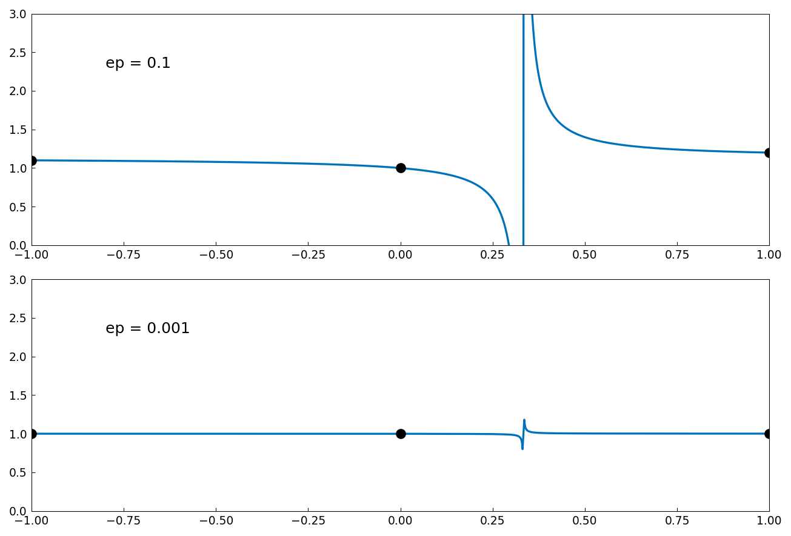
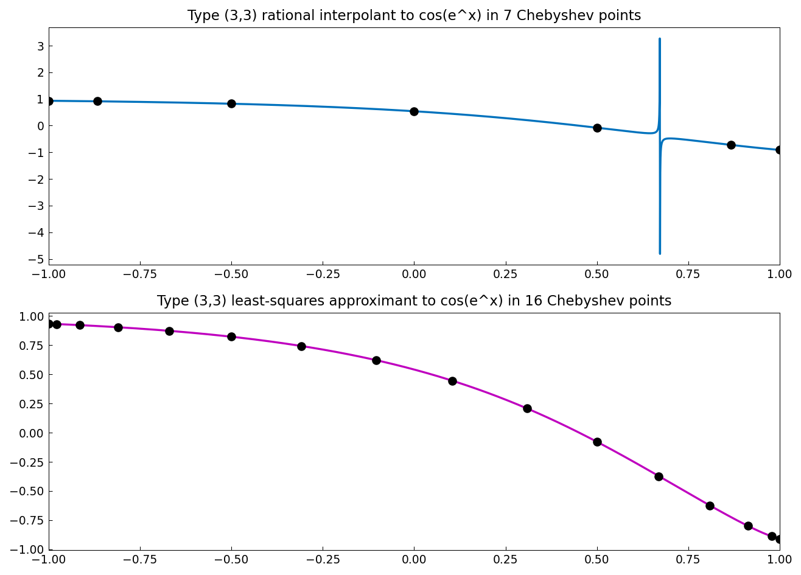
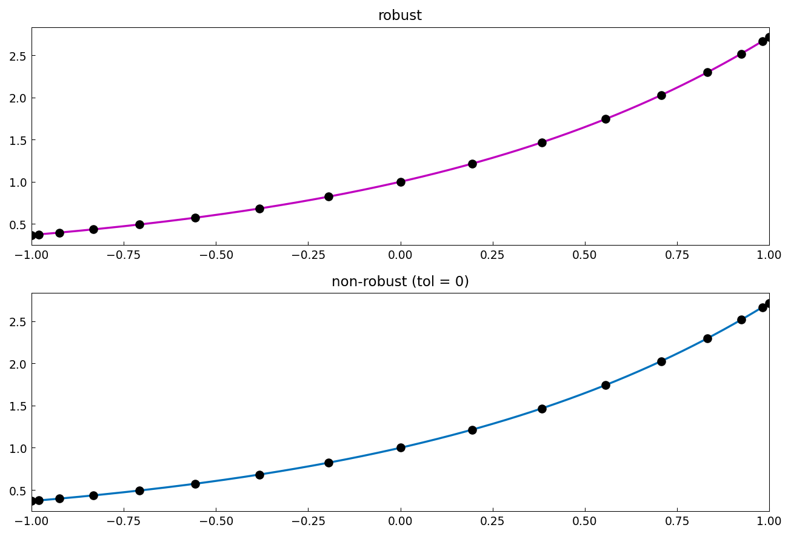

# Rational interpolation, robust and non-robust

*Nick Trefethen, August 2011*

[Original MATLAB Chebfun example](https://www.chebfun.org/examples/approx/RationalInterp.html)

(Chebfun example approx/RationalInterp.m)

A rational function is a quotient of two polynomials.  Many numerical
algorithms make use of rational interpolants and approximants,
including well-known methods for acceleration of convergence of
sequences and series [2].  If $f$ is a function on $[a,b]$, one may ask
for a rational function of type $(m,n)$ that interpolates $f$ at the
$N+1$ Chebyshev points, where $N=m+n$; if $N>m+n$, the problem is
solved by least squares.

The first example (Chapter 26 of [4]) can be solved analytically: the
type $(1,1)$ interpolant through $r(-1)=1+\varepsilon$, $r(0)=1$,
$r(1)=1+2\varepsilon$ always has a pole at $x=1/3$ whose residue
$4\varepsilon/3$ weakens but never vanishes:



So we see that rational interpolation can be tricky!  "Spurious"
pole-zero pairs may appear in unexpected places.  Here is the accuracy
of type $(n,n)$ interpolants to $\cos(e^x)$:

```python
from chebfunjax.utils.ratapprox import ratinterp
rh, a, b, mu, nu, poles, res = ratinterp(f, n, n)
```
```
    (n,n)       Error
    (1,1)     2.46e-01
    (2,2)     7.32e-03
    (3,3)         Inf
    (4,4)     6.11e-06
    (5,5)     4.16e-07
    (6,6)     6.19e-09
```

(The table matches the published output digit-for-digit, including the
Inf at $(3,3)$ caused by a spurious pole in the interval.)  Increasing
the number of sample points to a least-squares fit removes the
artifact:



The `ratinterp` command is robust by default: an SVD-based procedure
discards negligible singular values, reducing the degrees and
eliminating spurious pole-zero (Froissart) pairs.  Compare the robust
and non-robust ($tol=0$) type $(8,8)$ approximants of $e^x$:



The non-robust interpolant carries a nearly-cancelling pole-zero pair
in the interval:

```
spurious_zeros =
  -0.843334043567556
spurious_poles =
  -0.843334043567555
separation =
   2.220e-16
```

(The published run shows the same phenomenon with pairs at other
locations — Froissart artifacts sit at rounding-noise-determined
positions.)  The robust version reduces the degrees and has no spurious
roots at all, matching the published output exactly:

```
degree_of_p =
     8
spurious_zeros =
   Empty matrix: 0-by-1
degree_of_q =
     4
spurious_poles =
   Empty matrix: 0-by-1
```

## References

1. P. Gonnet, R. Pachon, and L. N. Trefethen, Robust rational
   interpolation and least-squares, _ETNA_, 38 (2011), 146-167.

2. C. Brezinski and M. Redivo Zaglia, _Extrapolation Methods_,
   North-Holland, 1991.

3. R. Pachon, P. Gonnet, and J. van Deun, Fast and stable rational
   interpolation in roots of unity and Chebyshev points, _SIAM J.
   Numer. Anal._, 50 (2012), 1713-1734.

4. L. N. Trefethen, _Approximation Theory and Approximation Practice_,
   SIAM, 2013.

---

*Replicated with [chebfunjax](https://github.com/ma-gilles/chebfunjax); original
example copyright The University of Oxford and The Chebfun Developers.*
