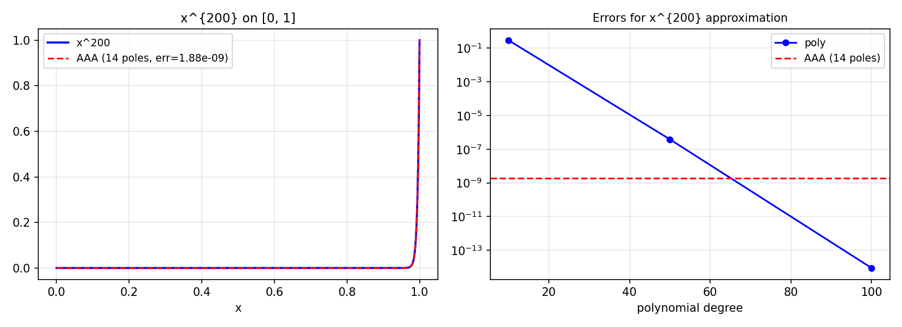

# Rational Approximation of Monomials

*Yuji Nakatsukasa and Nick Trefethen, May 2019*

[Original MATLAB Chebfun example](https://www.chebfun.org/examples/approx/Rationalxn.html)

## Monomials and rational approximation

The monomial $x^{200}$ on $[0,1]$ looks like it would be easy, but it has a
very sharp transition near 0 that requires high-degree polynomials. Rational
approximation does much better: a type $(2,2)$ approximant achieves accuracy
close to $10^{-2}$, and higher types improve rapidly.

```python
from chebfunjax.utils.aaa import aaa
import jax.numpy as jnp
import numpy as np

exp_val = 200
xs = jnp.linspace(0.0, 1.0, 300)
ys = xs**exp_val
r, pol, *_ = aaa(ys, xs)

test = np.linspace(0, 1, 500)
err = np.max(np.abs([float(r(jnp.array(x))) for x in test] - test**exp_val))
print(f"AAA ({len(pol)} poles): max err = {err:.2e}")
```



