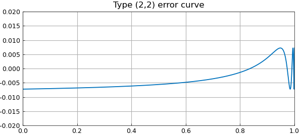
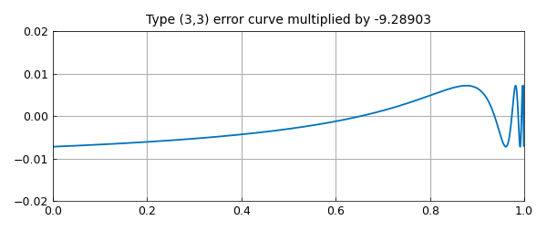

# Rational approximation of monomials

*Yuji Nakatsukasa and Nick Trefethen, May 2019*

[Original MATLAB Chebfun example](https://www.chebfun.org/examples/approx/Rationalxn.html)

Python translation: [`examples/approx/rationalxn.py`](https://github.com/ma-gilles/chebfunjax/blob/main/examples/approx/rationalxn.py)

Here is the error curve for type (2,2) best rational approximation of $x^{200}$ on $[0,1]$:

```matlab
x = chebfun('x',[0 1]);
f = x^200;
[p2,q2,r2,err2] = minimax(f,2,2);
plot(f-p2./q2), grid on, ylim([-.02 .02])
title('Type (2,2) error curve')
```



And here is the same figure for type (3,3), except multiplied by $-9.28903$:

```matlab
[p3,q3,r3,err3] = minimax(f,3,3);
plot(-9.28903*(f-p3./q3)), grid on, ylim([-.02 .02])
title('Type (3,3) error curve multiplied by -9.28903')
```



The curves have just about the same height! In fact, the ratio of these particular approximation errors is about 9.36:

```matlab
format short
err2
err3
ratio = err2/err3
```

```text
err2 =
    0.0072
err3 =
   7.7243e-04
ratio =
    9.3628
```

In rational approximation theory, the number $9.28903\dots$ is famous as the asymptotic rate at which rational approximations to $e^x$ on $(-\infty,0]$ improve each time you increase the degree by 1. It it known as (the reciprocal of) Halphen's constant, which has a Wikipedia entry. Here, we don't have $e^x$ on $(-\infty,0]$ but $x^n$ on $[0,1]$, where $n$ is a large number. It turns out that in a certain precise sense, this problem has the same asymptotic behavior. We proved this in a short paper that appeared last year [1].

The exponent $200$ above was of course not special. Look how little the numbers change if we increase it to $1000$:

```matlab
f = x^1000;
[p2,q2,r2,err2] = minimax(f,2,2);
[p3,q3,r3,err3] = minimax(f,3,3);
err2
err3
ratio = err2/err3
```

```text
err2 =
    0.0073
err3 =
   7.9394e-04
ratio =
    9.2366
```

Let's also crank up $k$ from $2$ and $3$ to $3$ and $4$. The approximation to $9.28903$ becomes closer:

```matlab
[p4,q4,r4,err4] = minimax(f,4,4);
ratio = err3/err4
```

```text
ratio =
    9.2805
```

[1] Y. Nakatsukasa and L. N. Trefethen, Rational approximation of $x^n$, *Proc. AMS* 146 (2018), 5219--5224.

---

*Translated with [chebfunjax](https://github.com/ma-gilles/chebfunjax); prose and MATLAB code from the original example, copyright The University of Oxford and The Chebfun Developers.  Printed outputs and figures are chebfunjax's.*
