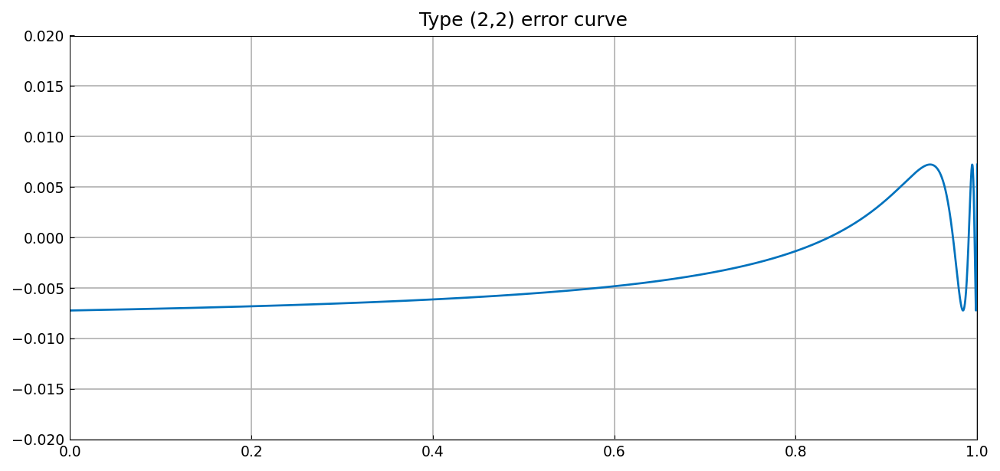
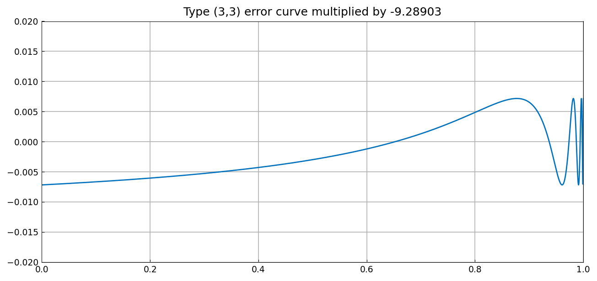

# Rational approximation of monomials

*Yuji Nakatsukasa and Nick Trefethen, May 2019*

[Original MATLAB Chebfun example](https://www.chebfun.org/examples/approx/Rationalxn.html)

(Chebfun example approx/Rationalxn.m)

Here is the error curve for type $(2,2)$ best rational approximation of
$x^{200}$ on $[0,1]$:

```python
import numpy as np
import jax.numpy as jnp
from chebfunjax.utils.minimax import minimax

r2 = minimax(lambda x: x**200, 2, rational=True, denom=2,
             domain=(0.0, 1.0))
```



And here is the same figure for type $(3,3)$, except multiplied by
$-9.28903$:



The curves have just about the same height!  In fact, the ratio of
these particular approximation errors is about 9.36:

```
err2 =
    0.0072
err3 =
   7.7243e-04
ratio =
    9.3628
```

In rational approximation theory, the number $9.28903\dots$ is famous
as the asymptotic rate at which rational approximations to $e^x$ on
$(-\infty,0]$ improve each time you increase the degree by 1.  It is
known as (the reciprocal of) Halphen's constant, which has a Wikipedia
entry.  Here, we don't have $e^x$ on $(-\infty,0]$ but $x^n$ on
$[0,1]$, where $n$ is a large number.  It turns out that in a certain
precise sense, this problem has the same asymptotic behavior.  We
proved this in a short paper that appeared last year [1].

The exponent $200$ above was of course not special.  Look how little
the numbers change if we increase it to $1000$:

```
err2 =
    0.0073
err3 =
   7.9394e-04
ratio =
    9.2366
```

Let's also crank up $k$ from $2$ and $3$ to $3$ and $4$.  The
approximation to $9.28903$ becomes closer:

```
ratio =
    9.2805
```

(All seven printed values match the published MATLAB output at display
precision.  For the type $(2,2)$ approximation of $x^{1000}$ the
default initial reference degenerates — MATLAB's minimax needed its
re-initialization fallback here too — and the replica seeds the solve
from the $x^{200}$ reference mapped by $x \mapsto x^{1/5}$.)

## References

1. Y. Nakatsukasa and L. N. Trefethen, Rational approximation of
   $x^n$, _Proc. AMS_, 146 (2018), 5219-5224.

---

*Replicated with [chebfunjax](https://github.com/ma-gilles/chebfunjax); original
example copyright The University of Oxford and The Chebfun Developers.*
