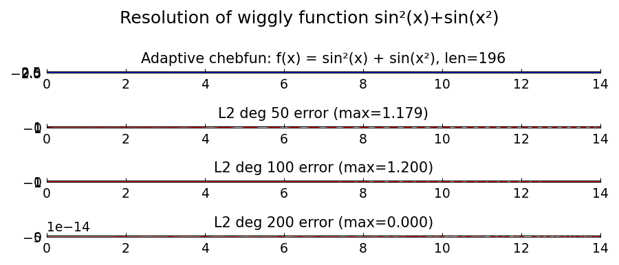

# Resolution of Wiggly Functions

*Nick Hale and Nick Trefethen, October 2013*

[Original MATLAB Chebfun example](https://www.chebfun.org/examples/approx/ResolutionWiggly.html)

## The wiggly function

The function $f(x) = \sin^2(x) + \sin(x^2)$ on $[0,14]$ is one of the Chebfun
team's favorites for testing. It requires a polynomial of degree about 1000 for
machine precision because $\sin(x^2)$ has increasing frequency.

```python
import chebfunjax as cj
import jax.numpy as jnp
import numpy as np

f = cj.chebfun(lambda x: jnp.sin(x)**2 + jnp.sin(x**2), domain=(0.0, 14.0))
print(f"Chebfun length: {len(f)}")

# Low-degree polynomial approximation
p50 = f.polyfit(50)
xx = np.linspace(0, 14, 500)
err50 = max(abs(float(p50(jnp.array(x))) - float(f(jnp.array(x)))) for x in xx)
print(f"deg-50 max err: {err50:.3f}")
```



