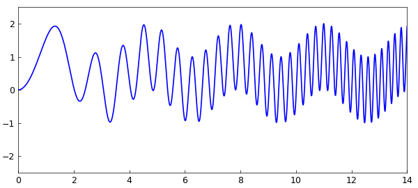
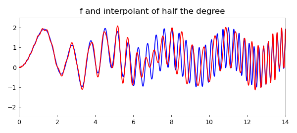
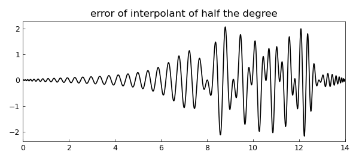
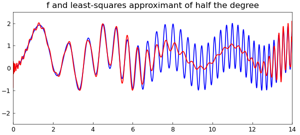
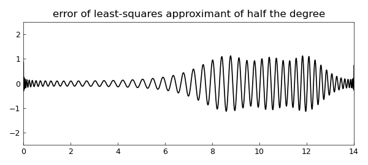
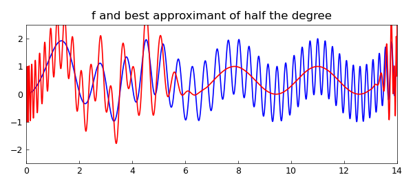
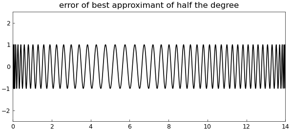

# Resolution of wiggly functions

*Nick Hale and Nick Trefethen, October 2013*

[Original MATLAB Chebfun example](https://www.chebfun.org/examples/approx/ResolutionWiggly.html)

Python translation: [`examples/approx/resolution_wiggly.py`](https://github.com/ma-gilles/chebfunjax/blob/main/examples/approx/resolution_wiggly.py)

One of the Chebfun team's favorite functions is this one,

```matlab
d = [0 14]; format compact
f = chebfun(@(x) sin(x).^2 + sin(x.^2), d);
LW = 'linewidth'; lw = 1.2;
hold off, plot(f, LW, lw, LW, lw), ylim([-2.5 2.5])
```



The degree of $f$ is moderate:

```matlab
np = length(f)
```

```text
np =
   196
```

It's interesting to see what happens when we compute approximations to $f$ of an intermediate degree. Let us arbitrarily choose the degree to be about half that of $f$:

```matlab
nphalf = round(np/2)
```

```text
nphalf =
    98
```

Here is what happens with interpolation:

```matlab
pinterp = chebfun(f, d, nphalf);
hold on, plot(pinterp, 'r', LW, lw), ylim([-2.5 2.5])
title('f and interpolant of half the degree')
```



It's clear from this figure that we have pretty good approximation on the left, where $f$ has low wave numbers, and not so good on the right. A plot of the error confirms this:

```matlab
hold off, plot(f-pinterp, 'k', LW, lw)
title('error of interpolant of half the degree')
```



Note that near the right-hand boundary the approximation improves again, reflecting the fundamental phenomenon that polynomials have less approximation power near the endpoints of an interval than in the middle, as discussed in Chapter 22 of [1].

What will happen if we change the method of interpolation? For a start, here is what happens if we change from interpolation to least-squares:

```matlab
pleastsq = polyfit(f, nphalf-1);
plot(f, 'b', pleastsq, 'r', LW, lw), ylim([ -2.5 2.5])
title('f and least-squares approximant of half the degree')
```



Qualitatively, the behavior is similar on the left half of the interval, but it is very different on the right half, where the least-squares approximant, unlike the interpolant, roughly tracks the low-wave-number signal. A plot of the error shows that its amplitude has approximately cut in half.

```matlab
hold off, plot(f-pleastsq, 'k', LW, lw), ylim([ -2.5 2.5])
title('error of least-squares approximant of half the degree')
```



Finally, here is what happens with best minimax approximation. Now we have beautifully smooth tracking of the low-wave-number signal on the right, but no accuracy at all on the left.

```matlab
warning off
pbest = remez(f, nphalf-1, 'maxiter', 100);
warning on
plot(f, 'b', pbest, 'r', LW, lw), ylim([ -2.5 2.5])
title('f and best approximant of half the degree')
```



The error curve shows its familiar equioscillatory behavior -- with smaller maximum than the other methods, but no ability to take advantage of regions where the function is simpler.

```matlab
hold off, plot(f-pbest, 'k', LW, lw), ylim([ -2.5 2.5])
title('error of best approximant of half the degree')
```



In summary, here is what we have observed:

*Interpolation*: good for low wave numbers and near boundaries, meaningless for high wave numbers.

*Least-squares*: good for low wave numbers and near boundaries, tracks the low-wave-number signal at high wave numbers.

*Minimax*: tracks the low-wave-number signal at high wave numbers, meaningless for low wave numbers.

## References

1. L. N. Trefethen, *Approximation Theory and Approximation Practice*, SIAM, 2013.

---

*Translated with [chebfunjax](https://github.com/ma-gilles/chebfunjax); prose and MATLAB code from the original example, copyright The University of Oxford and The Chebfun Developers.  Printed outputs and figures are chebfunjax's.*
