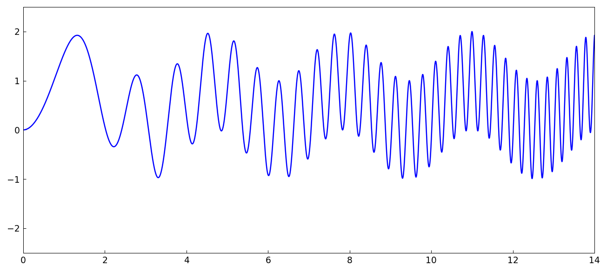
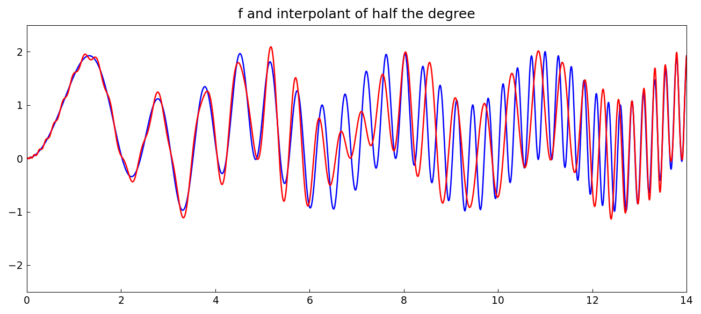
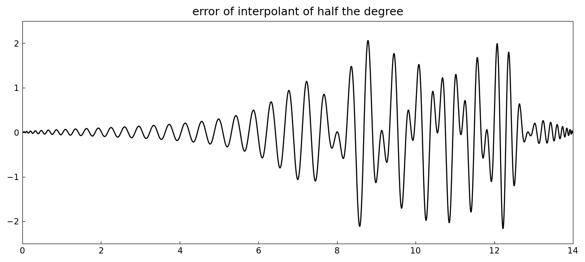
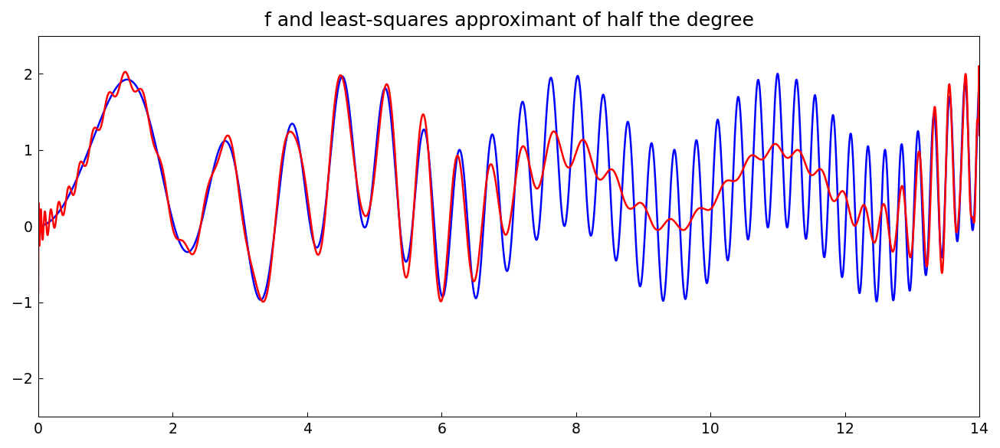
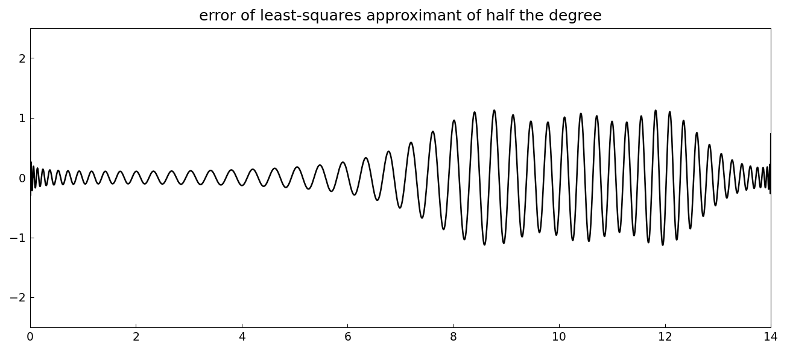
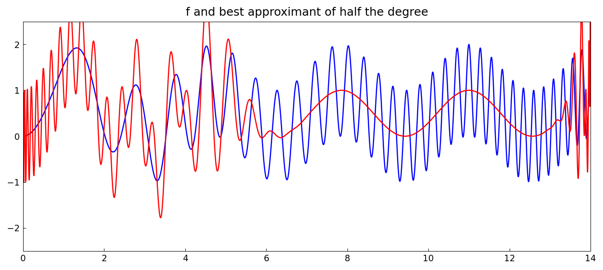
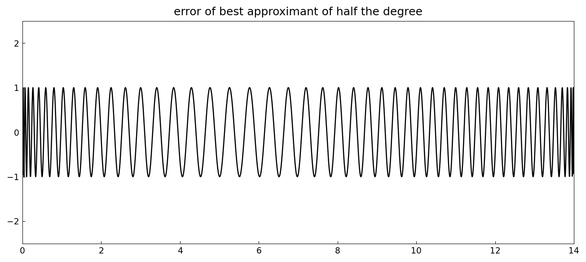

# Resolution of wiggly functions

*Nick Hale and Nick Trefethen, October 2013*

[Original MATLAB Chebfun example](https://www.chebfun.org/examples/approx/ResolutionWiggly.html)

(Chebfun example approx/ResolutionWiggly.m)

One of the Chebfun team's favorite functions is this one:

```python
import numpy as np
import jax.numpy as jnp
import chebfunjax as cj

f = cj.chebfun(lambda x: jnp.sin(x)**2 + jnp.sin(x**2),
               domain=(0.0, 14.0))
```



The degree of $f$ is moderate:

```python
len(f)
```
```
np =
   196
nphalf =
    98
```

(Both values match the published output exactly.)  It's interesting to
see what happens when we compute approximations to $f$ of an
intermediate degree.  Let us arbitrarily choose the degree to be about
half that of $f$.  Here is what happens with interpolation:

```python
pinterp = cj.chebfun(lambda x: f(x), domain=(0.0, 14.0), n=98)
```



It's clear from this figure that we have pretty good approximation on
the left, where $f$ has low wave numbers, and not so good on the right.
A plot of the error confirms this:



Note that near the right-hand boundary the approximation improves
again, reflecting the fundamental phenomenon that polynomials have less
approximation power near the endpoints of an interval than in the
middle, as discussed in Chapter 22 of [1].

What will happen if we change the method of interpolation?  For a
start, here is what happens if we change from interpolation to
least-squares:

```python
pleastsq = f.polyfit(97)
```



Qualitatively, the behavior is similar on the left half of the
interval, but it is very different on the right half, where the
least-squares approximant, unlike the interpolant, roughly tracks the
low-wave-number signal.  A plot of the error shows that its amplitude
has approximately cut in half:



Finally, here is what happens with best minimax approximation.  Now we
have beautifully smooth tracking of the low-wave-number signal on the
right, but no accuracy at all on the left:

```python
from chebfunjax.utils.minimax import minimax
res = minimax(lambda x: jnp.sin(x)**2 + jnp.sin(x**2), 97,
              domain=(0.0, 14.0), max_iter=100)
```



The error curve shows its familiar equioscillatory behavior — with
smaller maximum than the other methods, but no ability to take
advantage of regions where the function is simpler:



(Max errors: interpolation 2.17, least-squares 1.13, best 1.0000.  As
in the published MATLAB run, the degree-97 Remez iteration does not
fully converge and its warning is suppressed.)

## References

1. L. N. Trefethen, _Approximation Theory and Approximation Practice_,
   SIAM, 2013.

---

*Replicated with [chebfunjax](https://github.com/ma-gilles/chebfunjax); original
example copyright The University of Oxford and The Chebfun Developers.*
