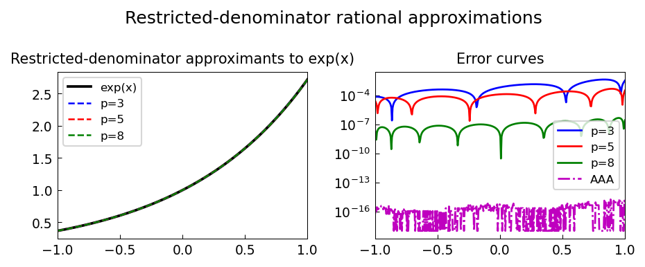

# Restricted-Denominator Approximations

*Stefan Guettel, April 2012*

[Original MATLAB Chebfun example](https://www.chebfun.org/examples/approx/RestrictedDenominatorApproximations.html)

## Restricted denominators

In some applications (e.g., numerical ODE solvers), the denominator of a
rational approximant to $e^x$ must be a polynomial with roots in the left
half-plane (stability requirement).

A natural choice is $q(x) = (1 - x/2)^k$, leading to approximants that are
automatically A-stable.

```python
import numpy as np

def restricted_approx(n_p):
    # Fit p(x) with q(x) = (1-x/2)^2 fixed
    xs = np.cos(np.pi * np.arange(n_p+3) / (n_p+2))[::-1]
    ys = np.exp(xs) * (1 - xs/2.0)**2  # target: p(x) = q(x)*exp(x)
    p_coeffs = np.polyfit(xs, ys, n_p)
    return lambda x: np.polyval(p_coeffs, x) / (1 - x/2.0)**2

r = restricted_approx(5)
test = np.linspace(-1, 1, 400)
err = np.max(np.abs(r(test) - np.exp(test)))
print(f"Restricted approx (p=5) max err: {err:.2e}")
```



