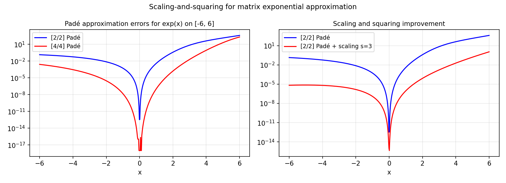

# Rational Approximation to the Exponential in a Complex Region

*Yuji Nakatsukasa and Stefan Guettel, July 2012*

[Original MATLAB Chebfun example](https://www.chebfun.org/examples/approx/ScalingAndSquaring.html)

## Scaling and squaring

The identity $e^A = (e^{A/2^s})^{2^s}$ allows computing $e^A$ by:
1. Scale: compute $B = A/2^s$ (small norm).
2. Approximate: $r(B) \approx e^B$ using a Padé approximant.
3. Square: $e^A \approx r(B)^{2^s}$.

The [4/4] Padé approximant to $e^x$ is:

$$r_{4/4}(x) = \frac{p_4(x)}{q_4(x)}$$

where $p_4$ and $q_4$ are degree-4 polynomials.

```python
from scipy.special import pade as scipy_pade
import numpy as np

# Compute [4/4] Pade approximant to exp(x)
taylor = np.array([1.0/np.math.factorial(k) for k in range(17)])
p44, q44 = scipy_pade(taylor, 4)

xs = np.linspace(-6, 6, 400)
err = np.max(np.abs(np.polyval(p44, xs)/np.polyval(q44, xs) - np.exp(xs)))
print(f"[4/4] Pade max err on [-6,6]: {err:.2e}")
```



