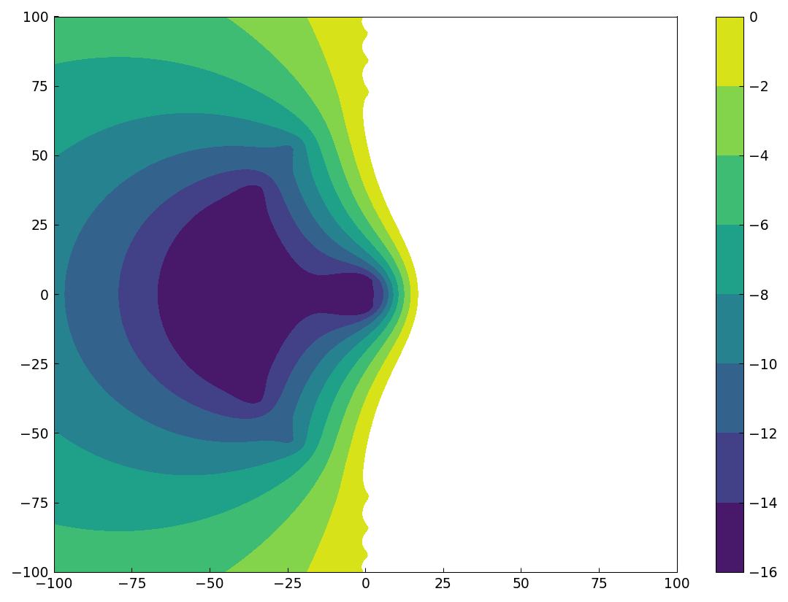
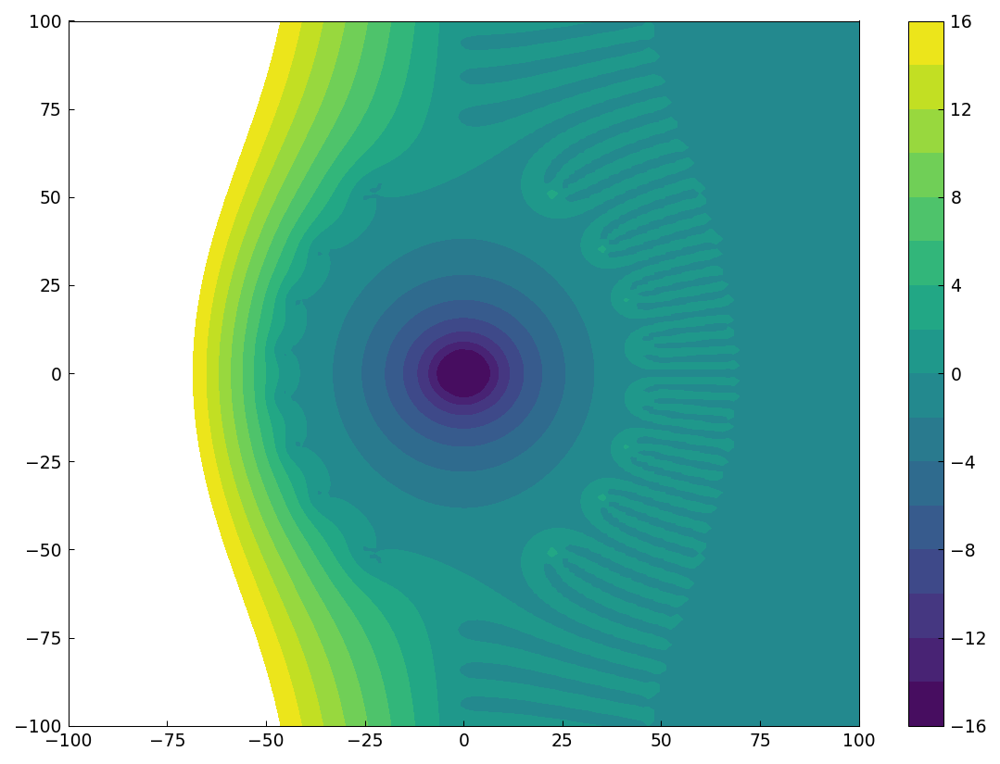

# Rational approximation to the exponential in a complex region

*Yuji Nakatsukasa and Stefan Guettel, July 2012*

[Original MATLAB Chebfun example](https://www.chebfun.org/examples/approx/ScalingAndSquaring.html)

(Chebfun example approx/ScalingAndSquaring.m)

Approximation of the exponential function has many applications, some
of which are described in other Chebfun examples.  Here we consider
approximating $e^z$ via a rational function in a region in the complex
plane, in the context of computing the matrix exponential $e^A$ via the
scaling and squaring method, the most commonly used method for this
purpose, cf. chapter 10 of [2].

In brief, the scaling and squaring method computes $e^A$ by first
choosing an integer $s$ such that $A/2^s$ has norm of order $1$, then
taking a rational (normally type $(m,m)$ Padé) approximation $r(z)$ to
$e^z$ so that $e^{A/2^s}\approx r(A/2^s)$, and finally computing
$e^A\approx (r(A/2^s))^{2^s}$ via repeated squaring.  If $A$ is
diagonalizable with $A=X\,\mathrm{diag}(\lambda_i)X^{-1}$, the error
satisfies

$$ \|e^A - Y\|_2 \leq \kappa_2(X)\max_{z\in {\cal D}}
\left|(r(z/2^s))^{2^s}-e^{z}\right|, $$

where $\cal D$ is a region containing the eigenvalues of $A$.  Below we
investigate the error $\left|(r(z/2^s))^{2^s}-e^{z}\right|$ for points
$z$ in the complex plane.

Padé approximants can be obtained simply and robustly via the
`padeapprox` command [1].  Here is a contour plot of the logarithm of
the error for the case $s=2$ and $m=8$:

```python
import numpy as np
from chebfunjax.utils.ratapprox import padeapprox

s, m = 2, 8
f = np.concatenate([[1.0], 1.0/np.cumprod(np.arange(1, 51))])  # exp
r, *_ = padeapprox(f, m, m, tol=0.0)

xgrid = np.linspace(-100, 100, 140)
x, y = np.meshgrid(xgrid, xgrid)
z = x + 1j*y
err = np.abs(np.exp(z) - r(z/2**s)**(2**s))
```



Since we are using a Padé approximation centered at the origin, the
error is zero at the origin and is expected to grow with $|z|$.
However, notice that the plot is highly nonsymmetric about the
imaginary axis: the error is large for large $\mathrm{Re}(z)>0$ and
small for $\mathrm{Re}(z)<0$.  In particular, the region in which the
error is $O(10^{-14})$ stretches much farther into the left complex
plane than the right.  This is perhaps not surprising because $e^z$
grows exponentially with $\mathrm{Re}(z)$, so for
$\mathrm{Re}(z)\ll 0$ the error is essentially just
$\left|(r(z/2^s))^{2^s}\right|$, which is itself small provided
$|r(z/2^s)| < 1$.

The relative error, on the other hand, looks completely different:



The graph shows that $(r(z/2^s))^{2^s}$ has no digits of relative
accuracy except in the blue region.  The two plots illustrate for
example that around the point $z=-50$, the relative accuracy is
terrible but the absolute accuracy is of order unit roundoff.  Hence
$(r(z/2^s))^{2^s}$ is a good approximant near $z=-50$ if we are
concerned with absolute accuracy instead of relative accuracy.

## References

1. P. Gonnet, S. Guettel, and L. N. Trefethen, Robust Padé approximation
   via SVD, _SIAM Review_, 55 (2013), 101-117.

2. N. J. Higham, _Functions of Matrices: Theory and Computation_, SIAM,
   2008.

3. L. N. Trefethen, _Approximation Theory and Approximation Practice_,
   SIAM, 2013.

---

*Replicated with [chebfunjax](https://github.com/ma-gilles/chebfunjax); original
example copyright The University of Oxford and The Chebfun Developers.*
