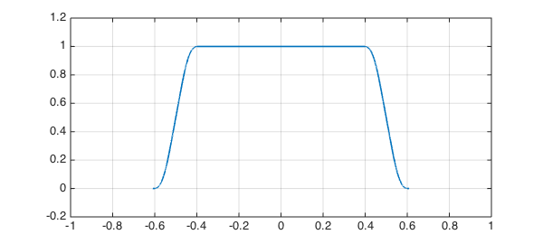
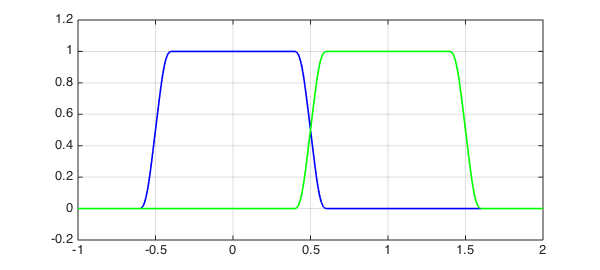
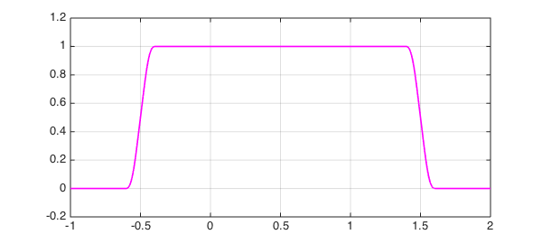

<!-- Generated by scripts/sync_chebfun_examples.py. -->
<!-- Source: https://www.chebfun.org/examples/approx/SmoothCompact.html -->

<h1>Smooth functions of compact support</h1>
<h2>Nick Trefethen, July 2014 in <a href='../'>approx</a><a href='/examples/approx/SmoothCompact.m'>download</a>&middot;<a href='//github.com/chebfun/examples/blob/master/approx/SmoothCompact.m'>view on GitHub</a></h2>

How do you make a smooth function with compact support? Ben Green tells me his favorite method is as follows.  Given $h&gt;0$, consider a square wave of width $h$ and height $1/h$:

<pre class="mcode-input">p = @(h) chebfun(1/h,[-h/2 h/2]);</pre>

Now convolve a few of these together with diminishing values of $h$, like this:

<pre class="mcode-input">f = p(1);
for k = 3:5
  f = conv(f,p(2^-k));
end
LW = 'linewidth';
plot(f,LW,1.6), grid on
axis([-1 1 -.2 1.2])</pre>

This function was constructed from three convolutions, so it will be of class $C^2$, with integral equal to 1:

<pre class="mcode-input">sum(f)</pre>

<pre class="mcode-output">ans =
     1
</pre>

By taking more and more terms, we can have any finite degree of smoothness, and an infinite convolution gives us a function in $C^\infty$.  It will have compact support if the sum of the values of $h$ is finite.

This gives a nice way to construct partitions of unity.  For example, here is the function above padded by zero values to the interval $[-1,2]$, and the same function shifted one unit to the right:

<pre class="mcode-input">[a,b] = domain(f);
f1 = chebfun({0, f, 0},[-1 a b 2]);
f2 = chebfun({0, newDomain(f,[a+1,b+1]), 0}, [-1 a+1 b+1 2]);
plot(f1,'b',f2,'g',LW,1.6), grid on, axis([-1 2 -.2 1.2])</pre>

Adding up such functions gives us unity:

<pre class="mcode-input">g = f1 + f2;
plot(g,'m',LW,1.6), grid on, axis([-1 2 -.2 1.2])</pre>

Constructions like this (both finite and infinite convolutions) have various applications, and among other things they are related to the <em>Denjoy-Carleman theorem</em> [1,2].

<h3 id="references">References</h3>
<ol>
<li>

P. J. Cohen, A simple proof of the Denjoy-Carleman theorem, <em>American Mathematical Monthly,</em> 75 (1968), 26-31.

</li>
<li>

Y. Katznelson, <em>An Introduction to Harmonic Analysis</em>, Dover, 1976.

</li>
</ol>

        

    

