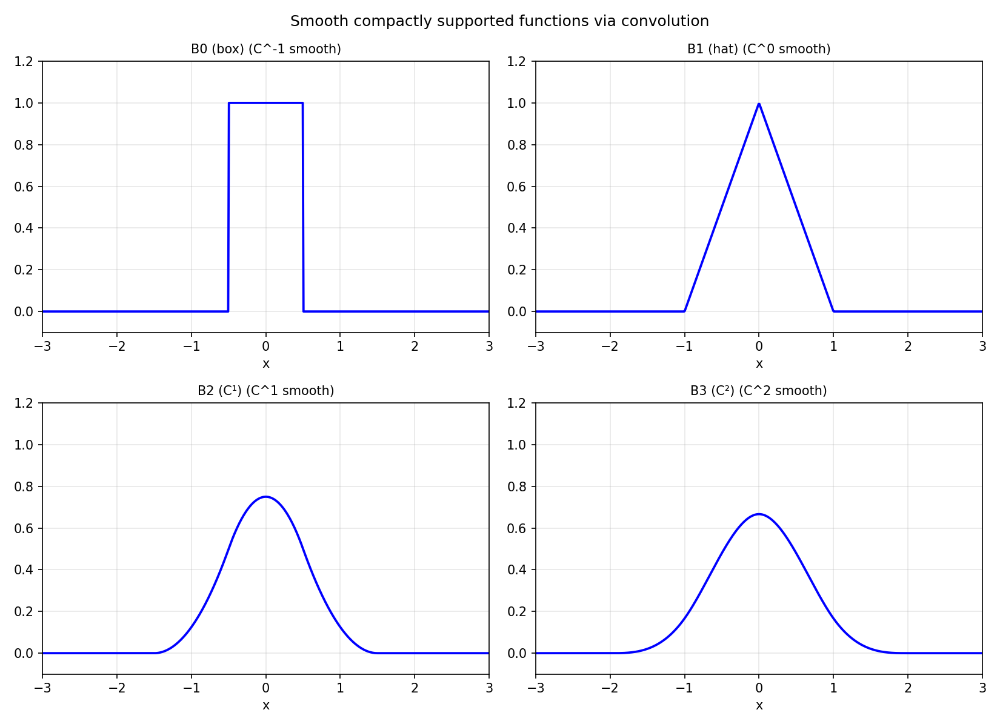

# Smooth Functions of Compact Support

*Nick Trefethen, July 2014*

[Original MATLAB Chebfun example](https://www.chebfun.org/examples/approx/SmoothCompact.html)

## Smooth bump functions

An infinitely smooth function with compact support can be constructed by
convolving a box function $B_0$ with itself $k$ times: $B_k = B_0^{*(k+1)}$.
Each convolution increases the smoothness class by one.

```python
import chebfunjax as cj
import jax.numpy as jnp

h = 0.5
B0 = cj.chebfun(lambda x: jnp.ones_like(x), domain=(-h, h))

B1 = B0.conv(B0)   # C^0, piecewise linear (hat function)
B2 = B1.conv(B0)   # C^1, piecewise quadratic
B3 = B2.conv(B0)   # C^2, cubic B-spline

print(f"B0 domain: [{B0.domain.breakpoints[0]:.1f}, {B0.domain.breakpoints[-1]:.1f}]")
print(f"B3 domain: [{B3.domain.breakpoints[0]:.1f}, {B3.domain.breakpoints[-1]:.1f}]")
print(f"B3 length: {len(B3)}")
```

As $k \to \infty$, these functions converge to a Gaussian.



