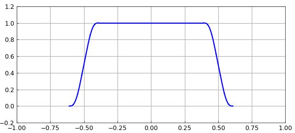
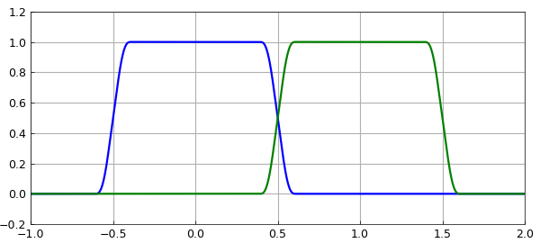
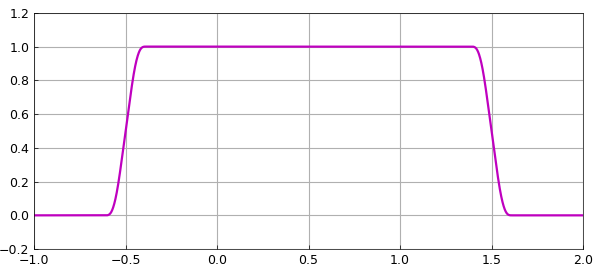

# Smooth functions of compact support

*Nick Trefethen, July 2014*

[Original MATLAB Chebfun example](https://www.chebfun.org/examples/approx/SmoothCompact.html)

Python translation: [`examples/approx/smooth_compact.py`](https://github.com/ma-gilles/chebfunjax/blob/main/examples/approx/smooth_compact.py)

How do you make a smooth function with compact support? Ben Green tells me his favorite method is as follows. Given $h>0$, consider a square wave of width $h$ and height $1/h$:

```matlab
p = @(h) chebfun(1/h,[-h/2 h/2]);
```

Now convolve a few of these together with diminishing values of $h$, like this:

```matlab
f = p(1);
for k = 3:5
  f = conv(f,p(2^-k));
end
LW = 'linewidth';
plot(f,LW,1.6), grid on
axis([-1 1 -.2 1.2])
```



This function was constructed from three convolutions, so it will be of class $C^2$, with integral equal to 1:

```matlab
sum(f)
```

```text
ans =
     1
```

By taking more and more terms, we can have any finite degree of smoothness, and an infinite convolution gives us a function in $C^\infty$. It will have compact support if the sum of the values of $h$ is finite.

This gives a nice way to construct partitions of unity. For example, here is the function above padded by zero values to the interval $[-1,2]$, and the same function shifted one unit to the right:

```matlab
[a,b] = domain(f);
f1 = chebfun({0, f, 0},[-1 a b 2]);
f2 = chebfun({0, newDomain(f,[a+1,b+1]), 0}, [-1 a+1 b+1 2]);
plot(f1,'b',f2,'g',LW,1.6), grid on, axis([-1 2 -.2 1.2])
```



Adding up such functions gives us unity:

```matlab
g = f1 + f2;
plot(g,'m',LW,1.6), grid on, axis([-1 2 -.2 1.2])
```



Constructions like this (both finite and infinite convolutions) have various applications, and among other things they are related to the *Denjoy-Carleman theorem* [1,2].

## References

1. P. J. Cohen, A simple proof of the Denjoy-Carleman theorem, *American Mathematical Monthly,* 75 (1968), 26-31.
2. Y. Katznelson, *An Introduction to Harmonic Analysis*, Dover, 1976.

---

*Translated with [chebfunjax](https://github.com/ma-gilles/chebfunjax); prose and MATLAB code from the original example, copyright The University of Oxford and The Chebfun Developers.  Printed outputs and figures are chebfunjax's.*
