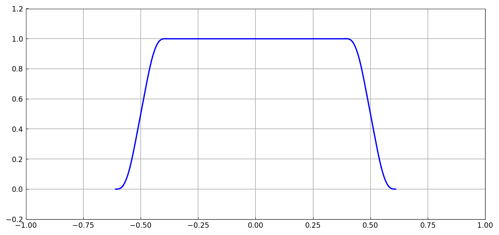
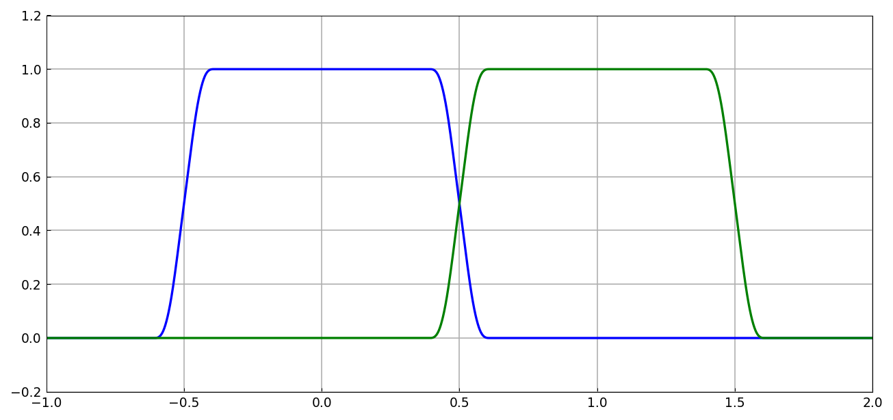
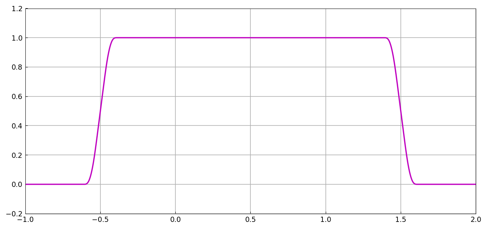

# Smooth functions of compact support

*Nick Trefethen, July 2014*

[Original MATLAB Chebfun example](https://www.chebfun.org/examples/approx/SmoothCompact.html)

(Chebfun example approx/SmoothCompact.m)

How do you make a smooth function with compact support?  Ben Green
tells me his favorite method is as follows.  Given $h>0$, consider a
square wave of width $h$ and height $1/h$.  Now convolve a few of these
together with diminishing values of $h$, like this:

```python
import jax.numpy as jnp
import chebfunjax as cj

p = lambda h: cj.chebfun(lambda x: (1.0/h) + 0*x, domain=(-h/2, h/2))
f = p(1.0)
for k in range(3, 6):
    f = f.conv(p(2.0**-k))
```



This function was constructed from three convolutions, so it will be of
class $C^2$, with integral equal to 1:

```python
f.sum()
```
```
ans =
     1
```

By taking more and more terms, we can have any finite degree of
smoothness, and an infinite convolution gives us a function in
$C^\infty$.  It will have compact support if the sum of the values of
$h$ is finite.

This gives a nice way to construct partitions of unity.  For example,
here is the function above padded by zero values to the interval
$[-1,2]$, and the same function shifted one unit to the right (via
`new_domain`, MATLAB's `newDomain`):

```python
fsh = f.new_domain((a + 1.0, b + 1.0))
```



Adding up such functions gives us unity:



Constructions like this (both finite and infinite convolutions) have
various applications, and among other things they are related to the
_Denjoy-Carleman theorem_ [1,2].

## References

1. P. J. Cohen, A simple proof of the Denjoy-Carleman theorem,
   _American Mathematical Monthly_, 75 (1968), 26-31.

2. Y. Katznelson, _An Introduction to Harmonic Analysis_, Dover, 1976.

---

*Replicated with [chebfunjax](https://github.com/ma-gilles/chebfunjax); original
example copyright The University of Oxford and The Chebfun Developers.*
