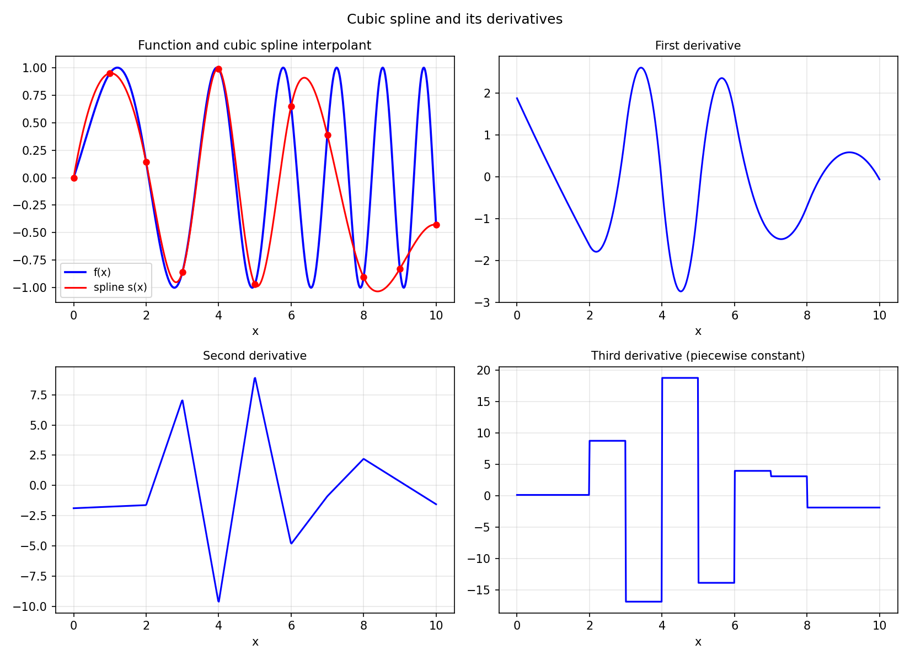

# Splines

*Nick Trefethen, February 2013*

[Original MATLAB Chebfun example](https://www.chebfun.org/examples/approx/Splines.html)

## Cubic spline interpolation

Chebfun has a `spline` command analogous to MATLAB's. It constructs a piecewise
cubic polynomial that interpolates given data and has two continuous derivatives.

```python
import chebfunjax as cj
import jax.numpy as jnp
import numpy as np
from scipy.interpolate import CubicSpline

# Underlying function
def f_func(x): return np.sin(x + 0.25*x**2)
nodes = np.arange(0, 11)
values = f_func(nodes)

# scipy cubic spline (same as MATLAB spline with not-a-knot)
cs = CubicSpline(nodes, values)

# Compare with adaptive chebfun
f = cj.chebfun(lambda x: jnp.sin(x + 0.25*x**2), domain=(0.0, 10.0))
print(f"Chebfun length: {len(f)}")
print(f"Spline continuity: C^2 (two continuous derivatives)")
```

The not-a-knot condition uses the two available degrees of freedom at the
endpoints to enforce $s'''(x)$ is continuous at $x_1$ and $x_{n-1}$.



