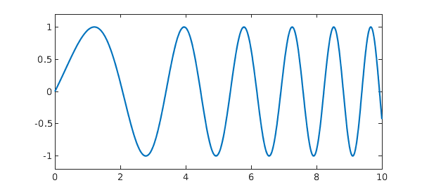
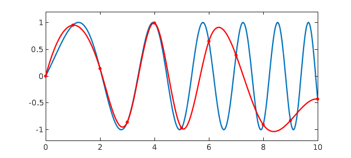
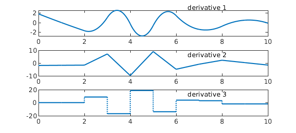

<!-- Generated by scripts/sync_chebfun_examples.py. -->
<!-- Source: https://www.chebfun.org/examples/approx/Splines.html -->

<h1>Splines</h1>
<h2>Nick Trefethen, February 2013 in <a href='../'>approx</a><a href='/examples/approx/Splines.m'>download</a>&middot;<a href='//github.com/chebfun/examples/blob/master/approx/Splines.m'>view on GitHub</a></h2>

Chebfun has an analogue of the MATLAB <code>spline</code> command. Here for example is a function on $[0,10]$:

<pre class="mcode-input">hold off
x = chebfun('x',[0 10]);
f = sin(x + 0.25*x.^2);
plot(f), axis([0 10 -1.2 1.2])</pre>

Let us call Chebfun <code>spline</code> to make a cubic spline $s$ that interpolates $f$ at the integers, and superimpose it on the same plot in red. Since a spline is just piecewise smooth, the Chebfun is made of a collection of funs, and we include red dots to mark the knots that separate them.

<pre class="mcode-input">s = chebfun.spline(0:10,f(0:10));
hold on, plot(s,'r')
plot(s.ends,s(s.ends),'.r','markersize',12)
axis([0 10 -1.2 1.2])</pre>

Here are the first, second, and third derivatives of $s$. The curves are respectively piecewise parabolic and continuously differentiable; piecewise linear and continuous; and piecewise constant.

<pre class="mcode-input">clf
for d = 1:3
   subplot(3,1,d)
   plot(diff(s,d))
   text(6.5,.8*2^(d+1),['derivative ' int2str(d)])
end</pre>

Note that in the final image, there is no discontinuity at $x=1$ or $x=9$. This is because by default, MATLAB imposes the "not-a-knot condition" to use up the 2 available free parameters of an interpolating piecewise cubic with two continuous derivatives.

One of Chebfun's features is its ability to locate discontinuities automatically in <code>splitting on</code> mode.  To illustrate this, suppose we construct a new chebfun <code>s2</code> by sampling <code>s</code> with splitting on. The accuracy is very good:

<pre class="mcode-input">s2 = chebfun(@(x) s(x),[0 10],'splitting','on');
norm(s-s2,inf)</pre>

<pre class="mcode-output">ans =
     7.207197801523897e-15
</pre>

Here are the breakpoints of the automatically constructed function <code>s2</code>. Note that $x=1$ and $x=9$ are missing, again because of the not-a-knot condition.

<pre class="mcode-input">format long
s2.ends'</pre>

<pre class="mcode-output">ans =
                   0
   2.000016742798088
   3.000003589995440
   4.000002798486513
   4.999996216568688
   5.999995262308749
   6.999989764271577
   7.999983937993889
  10.000000000000000
</pre>

It is interesting that breakpoints near $2,3,\dots,8$ match these values not to $15$ or $16$ digits but to about the cube root of that precision. This does not reflect poor performance of the splitting algorithm, but just the fact that the function being sampled has two continuous derivatives.  If it had only one continuous derivative, we'd get $8$ digits of accuracy, and if only the function itself were continuous, we'd expect $15$ or $16$ digits. When not even the function is continuous, Chebfun captures discontinuities down to the very last bit.  For information about edge detection in Chebfun, see [1].

<h3 id="references">References</h3>
<ol>
<li>R. Pachon, R. B. Platte, and L. N. Trefethen, Piecewise-smooth chebfuns,    <em>IMA Journal of Numerical Analysis</em>, 30 (2010), 898-916.</li>
</ol>

        

    

