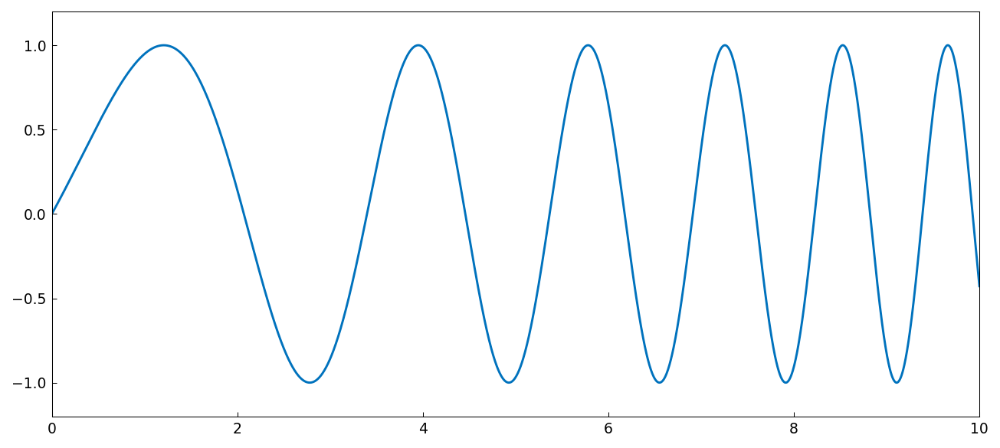
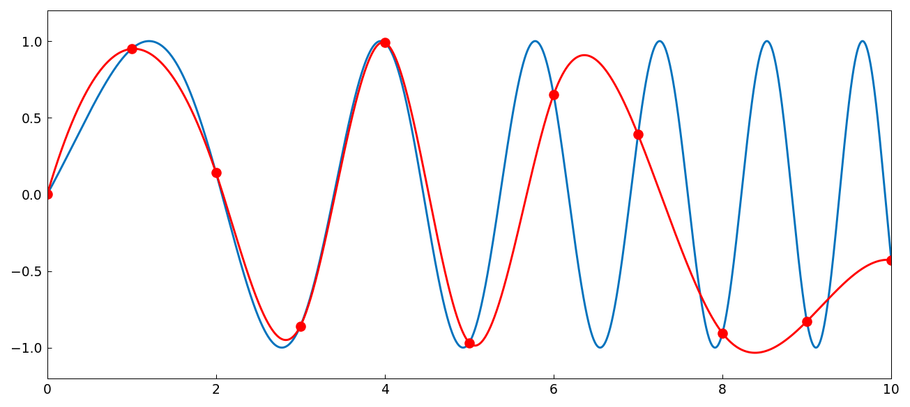
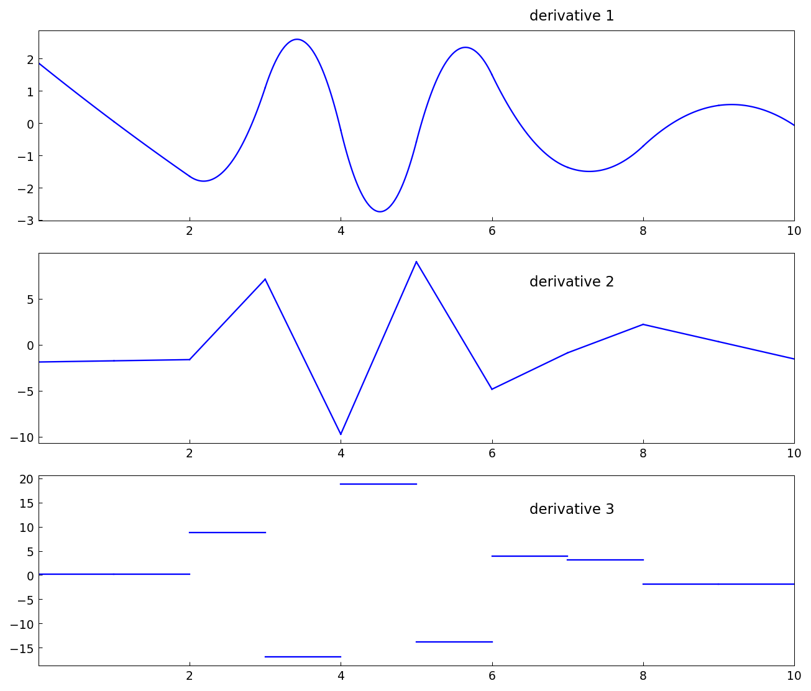

# Splines

*Nick Trefethen, February 2013*

[Original MATLAB Chebfun example](https://www.chebfun.org/examples/approx/Splines.html)

(Chebfun example approx/Splines.m)

Chebfun has an analogue of the MATLAB `spline` command.  Here is an
example.  First we plot a smooth function on $[0,10]$:

```python
import numpy as np
import jax.numpy as jnp
import chebfunjax as cj
from chebfunjax.chebfun1d.chebfun import Chebfun

f = cj.chebfun(lambda x: jnp.sin(x + 0.25*x**2), domain=(0.0, 10.0))
```



Now we construct the cubic spline interpolant through the samples of
this function at the integers, shown as red dots:

```python
nodes = np.arange(0, 11, dtype=np.float64)
s = Chebfun.spline(jnp.asarray(nodes),
                   jnp.asarray(np.asarray(f(jnp.asarray(nodes)))))
```



The spline $s$ is a piecewise cubic with two continuous derivatives.
Its first three derivatives look like this — the third derivative is
piecewise constant, jumping at the knots:



Chebfun's edge detector can recover the knots.  If we construct a new
chebfun `s2` from `s` with splitting on, edge detection finds
breakpoints near the interior knots $2,3,\dots,8$ (there are no
third-derivative jumps at $x=1$ and $x=9$ because of the not-a-knot end
conditions), and the two representations agree closely:

```python
s2 = cj.chebfun(lambda x: s(x), domain=(0.0, 10.0), splitting=True)
(s - s2).norm(np.inf)
```
```
ans =
     7.194932723385672e-12
```
```python
s2.domain.breakpoints
```
```
ans =
  0.000000000000000
  2.000027065990633
  2.999995997409854
  3.999985624010145
  5.000000574749964
  6.000021927961993
  7.000020356942192
  8.000019635837408
  10.000000000000000
```

(MATLAB's published run finds the same nine breakpoints with edges
$\sim 10^{-5}$ from the integers — e.g. `2.000016742798088` — and
agreement `7.2e-15`.  The $\sim 10^{-5}$ edge offsets are inherent to
detecting a jump in the *third* derivative; they are exactly small
enough that the cubic pieces on either side are resolved to full
precision.)

---

*Replicated with [chebfunjax](https://github.com/ma-gilles/chebfunjax); original
example copyright The University of Oxford and The Chebfun Developers.*
