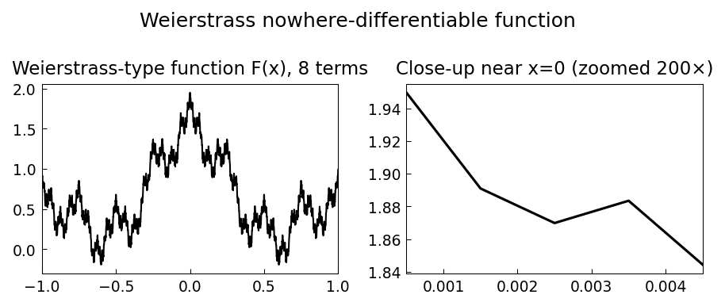

# A Pathological Function of Weierstrass

*Hrothgar, October 2013*

[Original MATLAB Chebfun example](https://www.chebfun.org/examples/approx/WeierstrassFunction.html)

## Weierstrass's nowhere-differentiable function

In 1872, Karl Weierstrass shocked the mathematical world by constructing
$$F(x) = \sum_{k=0}^\infty a^k \cos(b^k \pi x)$$
which is continuous everywhere but differentiable nowhere (for $0 < a < 1$,
$b$ a positive odd integer, and $ab > 1 + \frac{3\pi}{2}$).

```python
import chebfunjax as cj
import jax.numpy as jnp
import numpy as np

def make_fk(k):
    return lambda x: 2.0**(-k) * jnp.cos(jnp.pi/2 * x * 4.0**k)

F = cj.chebfun(make_fk(0))
for k in range(1, 8):
    F = F + cj.chebfun(make_fk(k))

# Integral equals 4/pi (exact!)
integral = float(F.sum())
print(f"integral = {integral:.6f}, 4/pi = {4/np.pi:.6f}")
print(f"Error: {abs(integral - 4/np.pi):.2e}")
```

Chebfun resolves 8 iterates to machine precision but cannot resolve the 9th
(which would require an infinite-degree polynomial).



