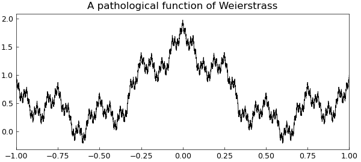
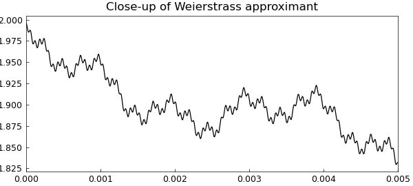

# A pathological function of Weierstrass

*Hrothgar, October 2013*

[Original MATLAB Chebfun example](https://www.chebfun.org/examples/approx/WeierstrassFunction.html)

Python translation: [`examples/approx/weierstrass_function.py`](https://github.com/ma-gilles/chebfunjax/blob/main/examples/approx/weierstrass_function.py)

```matlab
format compact
```

In the late nineteenth century, Karl Weierstrass rocked the analysis community when he constructed an example of a function that is everywhere continuous but nowhere differentiable. His now eponymous function, also one of the first appearances of fractal geometry, is defined as the sum $$ \sum_{k=0}^{\infty} a^k \cos(b^k \pi x), $$ where $0 < a < 1$ and $b$ is a positive odd integer with $ab < 1 + \frac32 \pi$. Since its publication, Weierstrass's work has been generalized in many directions.

Chebfun is designed for work with functions with a bit of smoothness, but in this example we will see how Chebfun fares against a pathological function lying on the edge of discontinuity.

Let us consider the Weierstrass-type function $$ F(x) = \sum_{k=0}^{\infty} 2^{-k} \cos\left( \frac{\pi}{2} 4^k x \right) $$ on the interval $[-1, 1]$. With its default parameter settings, Chebfun resolves the first eight iterates to machine precision, but not the ninth.

```matlab
f_k = @(k) @(x) 2^-k * cos(pi/2*x*4^k);
F{1} = chebfun(f_k(0));
for k = 1:8,
    F{k+1} = F{k} + chebfun(f_k(k));
end
```

Here is what the unresolved ninth iterate looks like.

```matlab
plot(F{9}, 'k')
title('A pathological function of Weierstrass')
```



We must zoom in 400 times to see that Chebfun is in fact plotting a smooth function.

```matlab
plot(F{9}, 'k', 'interval', [0 0.005])
title('Close-up of Weierstrass approximant')
```



The function $F(x)$ is not differentiable, but it is integrable. For this particular Weierstrass function, the exact value of the integral can be found easily. We begin with

$$ \int_{-1}^{1} F(x)\mathrm{d}x = \int_{-1}^{1} \sum_{k=0}^{\infty} f_k(x) \mathrm{d}x = \int_{-1}^{1} \sum_{k=0}^{\infty} 2^{-k} \cos\left( \frac{\pi}{2}4^k x \right) \mathrm{d}x. $$

Because $\int \sum |f_k| < \infty$, we can move the integral inside the sum and evaluate each term as

$$ \sum_{k=0}^{\infty} \int_{-1}^{1} 2^{-k} \cos\left( \frac{\pi}{2}4^k x \right) \mathrm{d}x = \sum_{k=0}^{\infty} \frac{1}{8^k} \frac{4}{\pi} \sin\left( \frac{\pi}{2} 4^k \right). $$

However, $\sin( \frac{\pi}{2} 4^k ) = 0$ for all $k > 0$, so the sum is equal to its first term, $\frac{4}{\pi}$.

Let's check our answer against Chebfun's.

```matlab
error = sum(F{9}) - 4/pi
```

```text
error =
     2.220446049250313e-16
```

A more difficult problem is to find the global minimum of $F(x)$ on the interval $[-1, 1]$. Even if it were possible to differentiate $F$ to find where $F'(x) = 0$, we would discover infinitely many local extrema. Of course, Chebfun's representation of $F$ is a polynomial approximant, so we can locate the roots of the derivative for any iterate. As we may expect, performance rapidly gets worse as we take more terms.

```matlab
tt = []; xx = []; mm = [];
for k = 1:2:7
    tic
    kk = (k+1)/2;
    [mm(kk), xx(kk)] = min(F{k});
    tt(kk) = toc;
end
str = [sprintf('%2s %11s %16s %19s\n', 'k', 'x_min', 'F_k(x_min)', 'computation time') ...
       repmat('-',1,52) sprintf('\n') ...
       sprintf('%2d %12.7f %+15.7f %11.2f sec\n', [(2:2:8); xx; mm; tt])];
disp(str)
```

```text
 k       x_min       F_k(x_min)    computation time
----------------------------------------------------
 2   -1.0000000      +0.0000000        0.93 sec
 4   -0.6196232      -0.0504416        1.08 sec
 6   -0.6010220      -0.1761766        2.97 sec
 8   -0.6000610      -0.2098447       29.63 sec
```

Chebfun is slowly converging to the actual solution given by $F_{min} = \sin(\frac{\pi}{5}) - \cos(\frac{\pi}{5}) = -0.2212317420...$ at the points $x = \pm \frac35$. Chebfun's difficulty is not with accurately locating the minima: the `x_min` iterates are geometrically converging to the correct solution as they should. The problem is that the iterates' global minima so slowly converge to the global minimum of $F$ while Chebfun must deal with polynomials of geometrically increasing degree.

## References

1. K. Weierstrass, *Abhandlungen aus der Functionenlehre*. J. Springer, 1886.
2. G. H. Hardy, "Weierstrass's non-differentiable function." *Transactions of the American Mathematical Society*, 17, no. 3 (1916), 301-325.
3. L. N. Trefethen, *Approximation Theory and Approximation Practice, Extended Edition*, SIAM, 2019._

---

*Translated with [chebfunjax](https://github.com/ma-gilles/chebfunjax); prose and MATLAB code from the original example, copyright The University of Oxford and The Chebfun Developers.  Printed outputs and figures are chebfunjax's.*
