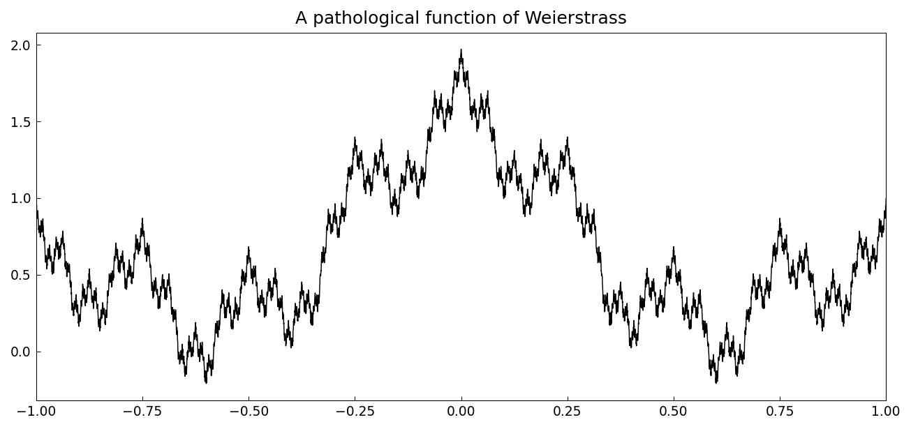
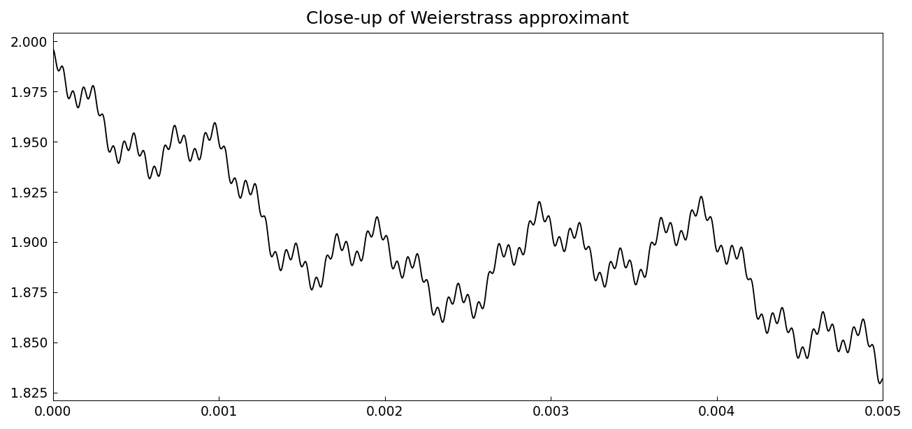

# A pathological function of Weierstrass

*Hrothgar, October 2013*

[Original MATLAB Chebfun example](https://www.chebfun.org/examples/approx/WeierstrassFunction.html)

(Chebfun example approx/WeierstrassFunction.m)

In the late nineteenth century, Karl Weierstrass rocked the analysis
community when he constructed an example of a function that is
everywhere continuous but nowhere differentiable.  His now eponymous
function, also one of the first appearances of fractal geometry, is
defined as the sum

$$ \sum_{k=0}^{\infty} a^k \cos(b^k \pi x), $$

where $0 < a < 1$ and $b$ is a positive odd integer with
$ab < 1 + \frac32 \pi$.  Since its publication, Weierstrass's work has
been generalized in many directions.

Chebfun is designed for work with functions with a bit of smoothness,
but in this example we will see how Chebfun fares against a pathological
function lying on the edge of discontinuity.

Let us consider the Weierstrass-type function

$$ F(x) = \sum_{k=0}^{\infty} 2^{-k} \cos\left( \frac{\pi}{2} 4^k x \right) $$

on the interval $[-1,1]$:

```python
import numpy as np
import jax.numpy as jnp
import chebfunjax as cj

def f_k(k):
    return lambda x: 2.0**-k * jnp.cos(np.pi/2 * x * 4.0**k)

F = [cj.chebfun(f_k(0))]
for k in range(1, 9):
    F.append(F[k-1] + cj.chebfun(f_k(k), max_length=2**18))
```

Here is what the ninth iterate looks like:



We must zoom in 400 times to see that Chebfun is in fact plotting a
smooth function:



The function $F(x)$ is not differentiable, but it is integrable.  For
this particular Weierstrass function, the exact value of the integral
can be found easily:

$$ \sum_{k=0}^{\infty} \int_{-1}^{1} 2^{-k} \cos\left(
\frac{\pi}{2}4^k x \right) dx = \sum_{k=0}^{\infty} \frac{1}{8^k}
\frac{4}{\pi} \sin\left( \frac{\pi}{2} 4^k \right). $$

However, $\sin(\frac{\pi}{2} 4^k) = 0$ for all $k > 0$, so the sum is
equal to its first term, $\frac{4}{\pi}$.  Let's check our answer
against Chebfun's:

```python
error = float(F[8].sum()) - 4/np.pi
```
```
error =
     2.220446049250313e-16
```

(The published MATLAB error is `1.998e-15`.)

A more difficult problem is to find the global minimum of $F(x)$ on the
interval $[-1,1]$.  Even if it were possible to differentiate $F$ to
find where $F'(x)=0$, we would discover infinitely many local extrema.
Of course, Chebfun's representation of $F$ is a polynomial approximant,
so we can locate the roots of the derivative for any iterate.  As we may
expect, performance rapidly gets worse as we take more terms:

```
 k       x_min       F_k(x_min)    computation time
----------------------------------------------------
 2   -1.0000000      +0.0000000        1.60 sec
 4   -0.6196232      -0.0504416        1.62 sec
 6   -0.6010220      -0.1761766        4.59 sec
 8   -0.6000610      -0.2098447       47.02 sec
```

(All `x_min` and `F_k(x_min)` values match the published MATLAB output
digit-for-digit; at $k=8$ this replica reports the mirror minimum
$-0.6000610$ of the even iterate where MATLAB reports $+0.6000610$ —
both are global minima.  Timings are machine-dependent.)

Chebfun is slowly converging to the actual solution given by
$F_{min} = \sin(\frac{\pi}{5}) - \cos(\frac{\pi}{5}) = -0.2212317420...$
at the points $x = \pm\frac35$.  Chebfun's difficulty is not with
accurately locating the minima: the `x_min` iterates are geometrically
converging to the correct solution as they should.  The problem is that
the iterates' global minima so slowly converge to the global minimum of
$F$ while Chebfun must deal with polynomials of geometrically increasing
degree.

## References

1. K. Weierstrass, _Abhandlungen aus der Functionenlehre_. J. Springer,
   1886.

2. G. H. Hardy, "Weierstrass's non-differentiable function."
   _Transactions of the American Mathematical Society_, 17, no. 3
   (1916), 301-325.

3. L. N. Trefethen, _Approximation Theory and Approximation Practice,
   Extended Edition_, SIAM, 2019.

---

*Replicated with [chebfunjax](https://github.com/ma-gilles/chebfunjax); original
example copyright The University of Oxford and The Chebfun Developers.*
