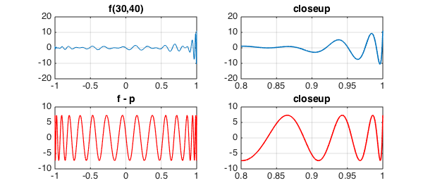
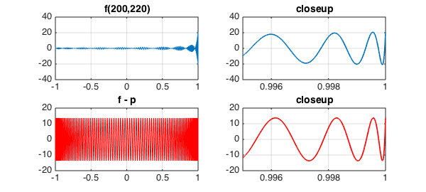

<!-- Generated by scripts/sync_chebfun_examples.py. -->
<!-- Source: https://www.chebfun.org/examples/approx/WigglyApprox.html -->

<h1>A wiggly function and its best approximations</h1>
<h2>Ricardo Pachon and Nick Trefethen, November 2010 in <a href='../'>approx</a><a href='/examples/approx/WigglyApprox.m'>download</a>&middot;<a href='//github.com/chebfun/examples/blob/master/approx/WigglyApprox.m'>view on GitHub</a></h2>

Ken Lord, whose doctoral supervisor was the Chebyshev technology wizard Charles Clenshaw, has explored functions of the form

$$ f(x) = T_m(x) + T_{m+1}(x) + \cdots + T_n(x), $$

where $T_k$ is the Chebyshev polynomial of degree $k$, as challenging functions for minimax approximation by polynomials of lower order. We can construct such functions in a single Chebfun command:

<pre class="mcode-input">fmn = @(m,n) sum(chebpoly(m:n),2);</pre>

For example, here we plot <code>f(30,40)</code> and its best approximation of degree $29$:

<pre class="mcode-input">LW = 'linewidth'; FS = 'fontsize'; fs = 14;
tic, m = 30; n = 40;
f = fmn(m,n);
subplot(2,2,1), plot(f,LW,1)
grid on, title('f(30,40)',FS,fs)
subplot(2,2,2), plot(f,'interval',[.8,1],LW,1.6)
grid on, title('closeup',FS,fs)
p = remez(f,m-1); err = f-p;
subplot(2,2,3), plot(err,'r',LW,1.2)
grid on, title('f - p',FS,fs)
subplot(2,2,4), plot(err{.8,1},'r',LW,1.6)
grid on, title('closeup',FS,fs), toc</pre>

<pre class="mcode-output">Elapsed time is 2.744878 seconds.
</pre>

Here are <code>f(200,220)</code> and its best approximation of degree $199$:

<pre class="mcode-input">tic, m = 200; n = 220;
f = fmn(m,n);
subplot(2,2,1), plot(f,LW,1)
grid on, title('f(200,220)',FS,fs)
subplot(2,2,2), plot(f{.995,1},LW,1.6)
grid on, title('closeup',FS,fs), xlim([.995 1])
p = remez(f,m-1); err = f-p;
subplot(2,2,3), plot(err,'r',LW,1)
grid on, title('f - p',FS,fs)
subplot(2,2,4), plot(err{.995,1},'r',LW,1.6)
grid on, title('closeup',FS,fs), xlim([.995 1]), toc</pre>

<pre class="mcode-output">Elapsed time is 1.239600 seconds.
</pre>

        

    

