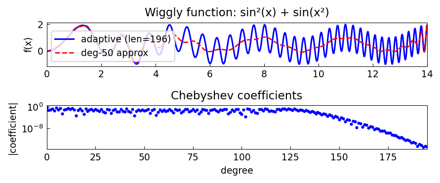

# A Wiggly Function and Its Best Approximations

*Ricardo Pachon and Nick Trefethen, November 2010*

[Original MATLAB Chebfun example](https://www.chebfun.org/examples/approx/WigglyApprox.html)

## The oscillatory function

The wiggly function $f(x) = \sin^2(x) + \sin(x^2)$ on $[0,14]$ has frequency
that increases with $x$: while $\sin^2(x)$ has frequency $1/\pi$, the term
$\sin(x^2)$ has instantaneous frequency $x/\pi$ at position $x$.

```python
import chebfunjax as cj
import jax.numpy as jnp
import numpy as np

f = cj.chebfun(lambda x: jnp.sin(x)**2 + jnp.sin(x**2), domain=(0.0, 14.0))
print(f"Adaptive chebfun degree: {len(f)}")

# Low-degree L2 approximant
p50 = f.polyfit(50)
xx = np.linspace(0, 14, 800)
err = [abs(float(p50(jnp.array(x))) - float(f(jnp.array(x)))) for x in xx]
print(f"deg-50 max err: {max(err):.3f}")
```

The adaptive chebfun requires a high-degree polynomial to capture the increasing
frequency of $\sin(x^2)$, while a low-degree approximant cannot resolve the
high-frequency content.



