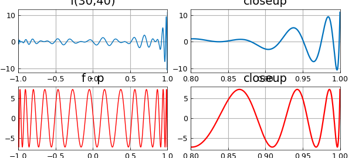
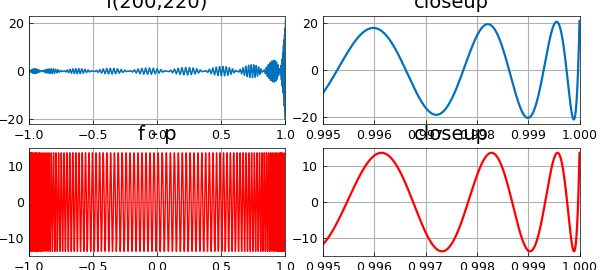

# A wiggly function and its best approximations

*Ricardo Pachon and Nick Trefethen, November 2010*

[Original MATLAB Chebfun example](https://www.chebfun.org/examples/approx/WigglyApprox.html)

Python translation: [`examples/approx/wiggly_approx.py`](https://github.com/ma-gilles/chebfunjax/blob/main/examples/approx/wiggly_approx.py)

Ken Lord, whose doctoral supervisor was the Chebyshev technology wizard Charles Clenshaw, has explored functions of the form

$$ f(x) = T_m(x) + T_{m+1}(x) + \cdots + T_n(x), $$

where $T_k$ is the Chebyshev polynomial of degree $k$, as challenging functions for minimax approximation by polynomials of lower order. We can construct such functions in a single Chebfun command:

```matlab
fmn = @(m,n) sum(chebpoly(m:n),2);
```

For example, here we plot `f(30,40)` and its best approximation of degree $29$:

```matlab
LW = 'linewidth'; FS = 'fontsize'; fs = 14;
tic, m = 30; n = 40;
f = fmn(m,n);
subplot(2,2,1), plot(f,LW,1)
grid on, title('f(30,40)',FS,fs)
subplot(2,2,2), plot(f,'interval',[.8,1],LW,1.6)
grid on, title('closeup',FS,fs)
p = remez(f,m-1); err = f-p;
subplot(2,2,3), plot(err,'r',LW,1.2)
grid on, title('f - p',FS,fs)
subplot(2,2,4), plot(err{.8,1},'r',LW,1.6)
grid on, title('closeup',FS,fs), toc
```

```text
Elapsed time is 2.564895 seconds.
```



Here are `f(200,220)` and its best approximation of degree $199$:

```matlab
tic, m = 200; n = 220;
f = fmn(m,n);
subplot(2,2,1), plot(f,LW,1)
grid on, title('f(200,220)',FS,fs)
subplot(2,2,2), plot(f{.995,1},LW,1.6)
grid on, title('closeup',FS,fs), xlim([.995 1])
p = remez(f,m-1); err = f-p;
subplot(2,2,3), plot(err,'r',LW,1)
grid on, title('f - p',FS,fs)
subplot(2,2,4), plot(err{.995,1},'r',LW,1.6)
grid on, title('closeup',FS,fs), xlim([.995 1]), toc
```

```text
Elapsed time is 5.158438 seconds.
err1 = 7.326695, err2 = 13.690370
```



---

*Translated with [chebfunjax](https://github.com/ma-gilles/chebfunjax); prose and MATLAB code from the original example, copyright The University of Oxford and The Chebfun Developers.  Printed outputs and figures are chebfunjax's.*
