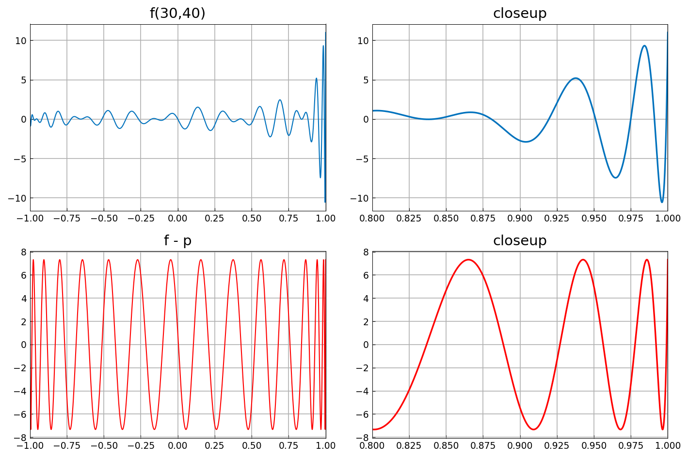
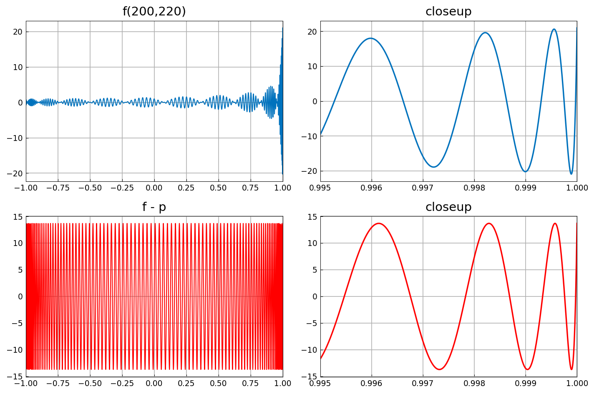

# A wiggly function and its best approximations

*Ricardo Pachon and Nick Trefethen, November 2010*

[Original MATLAB Chebfun example](https://www.chebfun.org/examples/approx/WigglyApprox.html)

(Chebfun example approx/WigglyApprox.m)

Ken Lord, whose doctoral supervisor was the Chebyshev technology wizard
Charles Clenshaw, has explored functions of the form

$$ f(x) = T_m(x) + T_{m+1}(x) + \cdots + T_n(x), $$

where $T_k$ is the Chebyshev polynomial of degree $k$, as challenging
functions for minimax approximation by polynomials of lower order.  We
can construct such functions in a single Chebfun command:

```python
import numpy as np
import jax.numpy as jnp
import chebfunjax as cj
from chebfunjax.utils.minimax import minimax

def fmn(m, n):
    c = np.zeros(n + 1)
    c[m:n+1] = 1.0
    return cj.chebfun(jnp.asarray(c), coeffs=True)
```

For example, here we plot `f(30,40)` and its best approximation of
degree $29$:

```python
f = fmn(30, 40)
res = minimax(lambda x: f(x), 29)
```



Here are `f(200,220)` and its best approximation of degree $199$:

```python
f = fmn(200, 220)
res = minimax(lambda x: f(x), 199)
```



In both cases the error curve $f-p$ equioscillates over the whole
interval, with the oscillation compressed toward the endpoints where
the Chebyshev-sum function itself oscillates fastest.

---

*Replicated with [chebfunjax](https://github.com/ma-gilles/chebfunjax); original
example copyright The University of Oxford and The Chebfun Developers.*
