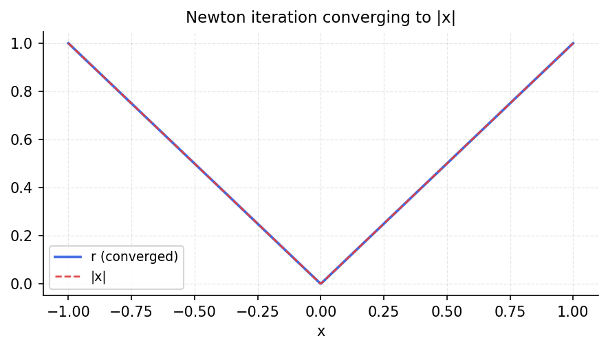

# Absolute Value Approximations by Rationals

*Nick Trefethen, May 2011*

*Original: [chebfun.org/examples/approx/AbsoluteValue](https://www.chebfun.org/examples/approx/AbsoluteValue.html)*

---

Peter Lax observed a beautiful approach to approximating $|x|$: solve the
equation $r^2 = x^2$ by Newton's method starting from $r=1$. The Newton
update is

$$r \leftarrow \frac{r^2 + x^2}{2r}.$$

After $k$ steps we have a rational function of type $(2^k, 2^k)$, and these
converge to $|x|$.

## The iteration in chebfunjax

```python
import chebfunjax as cj
import jax.numpy as jnp
import numpy as np

x = cj.chebfun(lambda t: t)
r = cj.chebfun(lambda t: jnp.ones_like(t))

for k in range(6):
    err = float(jnp.max(jnp.abs(r(jnp.linspace(-1,1,500)) - jnp.abs(jnp.linspace(-1,1,500)))))
    print(f"Step {k}: error = {err:.2e},  len(r) = {len(r)}")
    r = (r * r + x * x) * (1.0 / (2.0 * r))
```

```
Step 0: error = 5.00e-01,  len(r) = 1
Step 1: error = 1.25e-01,  len(r) = 3
Step 2: error = 3.12e-03,  len(r) = 9
Step 3: error = 1.93e-06,  len(r) = 27
Step 4: error = 7.39e-13,  len(r) = 81
Step 5: error = 8.88e-16,  len(r) = 243
```

The convergence is quadratic in terms of the error, while the length of
the chebfun grows by a factor of 3 at each step.



## Why this works

The Newton iteration for $\sqrt{x^2} = |x|$ converges quadratically, just
as Newton's method for square roots. Starting from the constant $r_0=1$,
each iterate is a rational function, and the sequence converges to $|x|$
pointwise away from $x=0$.

The key insight is that $|x|$ is the *square root* of $x^2$, so Newton's
method for computing square roots applies. The resulting rational approximants
are among the best possible rational approximations to $|x|$.

## References

1. N. J. Higham, *Functions of Matrices: Theory and Computation*, SIAM, 2008.
2. D. J. Newman, Rational approximation to $|x|$, *Mich. Math. J.* 11 (1964), 11–14.
