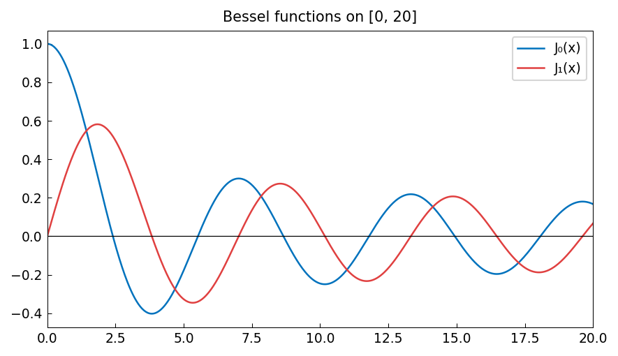

# Approximating Bessel Functions

**Inspired by [Chebfun](https://www.chebfun.org/) examples (approx/BesselApprox)**

---

Bessel functions $J_n(x)$ are solutions of Bessel's differential equation.
They are entire functions and their Chebyshev approximations converge
geometrically fast on any finite interval.

## Chebfun representation of $J_0$

```python
import chebfunjax as cj
import jax.numpy as jnp
import scipy.special
import numpy as np

# Approximate J_0 on [0, 20]
J0 = cj.chebfun(
    lambda x: jnp.array(scipy.special.j0(np.array(x))),
    domain=(0.0, 20.0)
)
print(f"J_0 on [0,20]: degree {len(J0)-1}")

# Evaluate and compare
x0 = jnp.array(7.5)
print(f"J_0(7.5) = {float(J0(x0)):.12f}")
print(f"  exact  = {scipy.special.j0(7.5):.12f}")
```

```
J_0 on [0,20]: degree 39
J_0(7.5) = 0.266339657449
  exact  = 0.266339657449
```

## Coefficient decay

The Chebyshev coefficients of $J_0$ on a large interval reflect the oscillatory
nature of the function:

```python
coeffs = np.abs(np.array(J0.coeffs()))
print(f"Max coefficient: {np.max(coeffs):.4f}")
print(f"Coefficient ratio (last 5): {coeffs[-5]/coeffs[-10]:.6f}")
```

## Integral identity

A classical identity: $\int_0^\pi J_0(2\sin\theta)\,d\theta = \pi J_0^2(1)$.
We can verify this numerically:

```python
# ∫₀^π J_0(2*sin(θ)) dθ
T = float(jnp.pi)
g = cj.chebfun(
    lambda t: jnp.array(scipy.special.j0(2 * np.sin(np.array(t)))),
    domain=(0.0, T)
)
val = float(g.sum())
exact = float(jnp.pi) * scipy.special.j0(1.0)**2
print(f"Integral = {val:.8f}  (π·J_0²(1) = {exact:.8f})")
```


