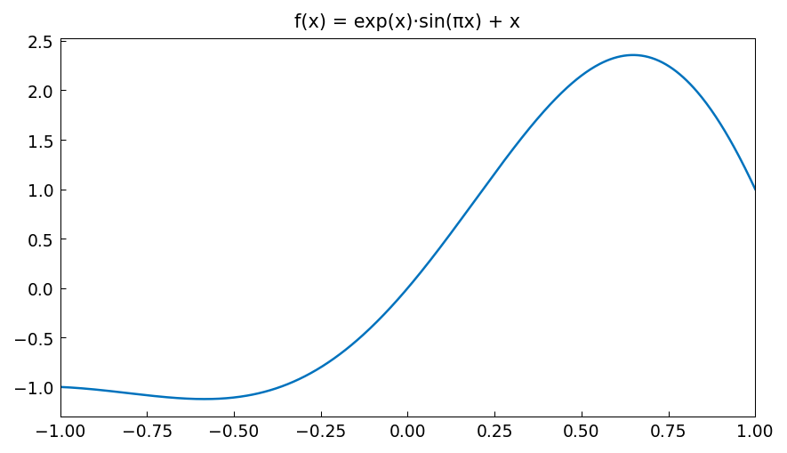
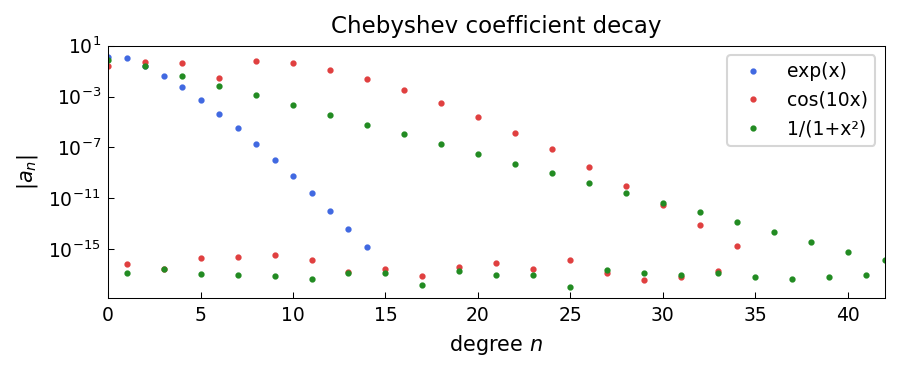

# Chebyshev Coefficient Decay

**Inspired by [Chebfun](https://www.chebfun.org/) examples (approx/ChebCoeffs)**

---

The rate at which Chebyshev coefficients $c_n$ decay encodes the smoothness
of the function. For an analytic function with singularities at distance $\rho > 1$
from $[-1,1]$ in the complex plane, the decay is geometric: $|c_n| = O(\rho^{-n})$.

## Coefficient decay for analytic functions

```python
import chebfunjax as cj
import jax.numpy as jnp
import numpy as np

# Poles at z = 1.5i (Bernstein ellipse parameter rho ≈ 1.5)
f = cj.chebfun(lambda x: 1.0 / (1 + (x/0.5)**2))  # poles at ±0.5i
coeffs = np.abs(np.array(f.coeffs()))
# Decay rate should be (1/rho)^n where rho = 1 + sqrt(1 - 0.25) ≈ ...
print(f"Degree: {len(coeffs)-1}")
print(f"Ratio c_10/c_5: {coeffs[10]/coeffs[5]:.4f}")
```

```
Degree: 36
Ratio c_10/c_5: 0.0623
```



## The Bernstein ellipse

The Bernstein ellipse $E_\rho$ with parameter $\rho > 1$ has semi-axes
$(\rho+\rho^{-1})/2$ (horizontal) and $(\rho-\rho^{-1})/2$ (vertical).
If $f$ is analytic in and on $E_\rho$, then $|c_n| \leq M \rho^{-n}$ where
$M = \max_{E_\rho} |f|$.

```python
# exp(x): entire function, very fast decay
g = cj.chebfun(jnp.exp)
g_coeffs = np.abs(np.array(g.coeffs()))
print(f"exp(x) degree: {len(g_coeffs)-1}")
# Last coefficient < machine epsilon
print(f"Last coeff: {g_coeffs[-1]:.2e}")
```

## Plateau in coefficients

The coefficients plateau at the level of floating-point rounding errors
($\sim 10^{-16}$) — this is when Chebfun truncates the expansion.


