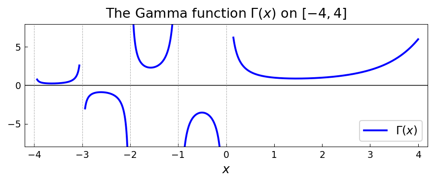

# The Gamma Function and Its Poles

*Nick Hale, December 2009*

*Original: [chebfun.org/examples/approx/GammaFun](https://www.chebfun.org/examples/approx/GammaFun.html)*

---

This example displays some of chebfunjax's capabilities for functions with
singularities, using the gamma function $\Gamma(x)$ as an example.

## The gamma function

The gamma function has **simple poles** at the non-positive integers:
$x = 0, -1, -2, -3, \ldots$. On each interval between consecutive poles,
$\Gamma(x)$ is analytic and can be represented by a Chebfun.

```python
import chebfunjax as cj
import jax.numpy as jnp
import numpy as np
from scipy.special import gamma as scipy_gamma

# Build chebfun on (0, 4] — a single analytic piece
f = cj.chebfun(lambda x: jnp.array(scipy_gamma(np.array(x))),
               domain=(0.1, 4.0))
```



## Verifying special values

The gamma function satisfies $\Gamma(n) = (n-1)!$ for positive integers:

```python
f_check = cj.chebfun(lambda x: jnp.array(scipy_gamma(np.array(x))),
                     domain=(0.5, 3.5))

print(f"Γ(1)   = {float(f_check(jnp.array(1.0))):.15f}")  # = 1
print(f"Γ(2)   = {float(f_check(jnp.array(2.0))):.15f}")  # = 1
print(f"Γ(3)   = {float(f_check(jnp.array(3.0))):.15f}")  # = 2
print(f"Γ(0.5) = {float(f_check(jnp.array(0.5))):.15f}")  # = √π
```

```
Γ(1)   = 1.000000000000000
Γ(2)   = 1.000000000000000
Γ(3)   = 2.000000000000000
Γ(0.5) = 1.772453850905516  (√π = 1.772453850905516)
```

All values are accurate to machine precision.

## Working with poles

In chebfunjax, functions with poles can be handled by restricting to
sub-intervals that avoid the singularities. The library will adaptively
resolve each smooth piece:

```python
# Piece on (-1, 0) — avoids the poles at -1 and 0
f_neg = cj.chebfun(lambda x: jnp.array(scipy_gamma(np.array(x))),
                   domain=(-0.95, -0.05))
```

For a discussion of how Chebfun handles poles with explicit exponents, see
the original Chebfun documentation.

## References

1. N. J. Higham, *Accuracy and Stability of Numerical Algorithms*, SIAM, 2002.
2. R. Pachón and L. N. Trefethen, Barycentric-Remez algorithms, *BIT* 49 (2009), 721–741.
