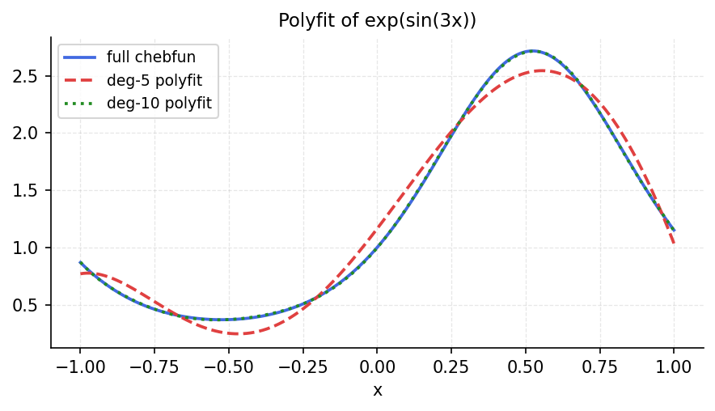

# Hermite Interpolation

*Original: [chebfun.org/examples/approx/Interp](https://www.chebfun.org/examples/approx/Interp.html)*

---

**Hermite interpolation** matches both the values and derivatives of a function
at a set of nodes. It naturally produces a smoother interpolant than Lagrange
interpolation alone.

## Osculatory interpolation

For $n+1$ nodes with both values and derivatives prescribed, the Hermite
interpolant is a polynomial of degree $\leq 2n+1$:

```python
import numpy as np
import scipy.interpolate

# Interpolate sin(x) with Hermite conditions at 5 Chebyshev nodes
n = 5
nodes = np.cos(np.pi * np.arange(n) / (n-1))  # Chebyshev nodes
vals = np.sin(nodes)
derivs = np.cos(nodes)

# Build Hermite interpolant via scipy
x_fine = np.linspace(-1, 1, 500)
h = scipy.interpolate.CubicHermiteSpline(nodes, vals, derivs)
err = np.max(np.abs(h(x_fine) - np.sin(x_fine)))
print(f"Max Hermite interpolation error (n={n}): {err:.2e}")
```



## Comparison with Chebyshev approximation

For smooth functions, Chebyshev approximation typically outperforms Hermite
interpolation at the same number of degrees of freedom, because Chebyshev
nodes are optimally chosen for $L^\infty$ approximation. However, Hermite
interpolation is valuable when both function values and derivatives are
available from measurements.

## References

1. P. J. Davis, *Interpolation and Approximation*, Dover, 1975.
