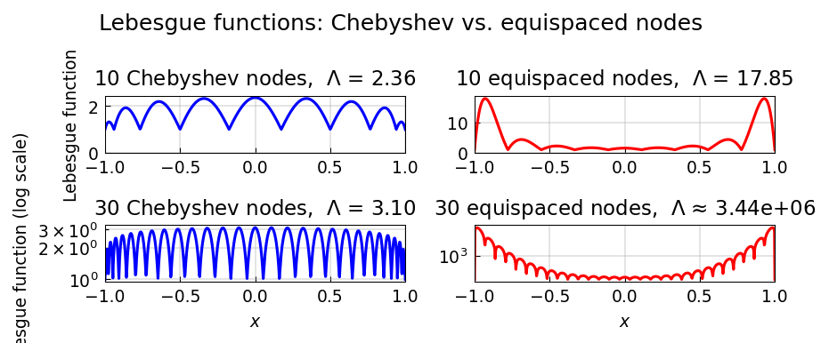

# Lebesgue Functions and Lebesgue Constants

*Nick Trefethen, November 2010*

*Original: [chebfun.org/examples/approx/LebesgueConst](https://www.chebfun.org/examples/approx/LebesgueConst.html)*

---

Suppose we have $n+1$ interpolation nodes $x_0,\ldots,x_n$ in $[-1,1]$ and
want to interpolate a function $f$ at these points by a degree-$n$ polynomial
$p$. The **Lebesgue function** at $x$ is

$$\Lambda(x) = \sum_{j=0}^{n} |\ell_j(x)|,$$

where $\ell_j$ are the Lagrange basis polynomials. It measures the worst-case
amplification of errors: if $|f(x_j)| \leq 1$ for all $j$, then
$|p(x)| \leq \Lambda(x)$.

The **Lebesgue constant** $\Lambda_n = \max_x \Lambda(x)$ is the
$\ell^\infty \to L^\infty$ operator norm of polynomial interpolation.

## Chebyshev vs. equispaced nodes

The choice of nodes dramatically affects the Lebesgue constant:

```python
import numpy as np

n = 10
# Chebyshev nodes of the 2nd kind
cheb_nodes = -np.cos(np.pi * np.arange(n) / (n - 1))
# Equispaced nodes
equi_nodes = np.linspace(-1, 1, n)
```

For $n=10$ Chebyshev nodes, $\Lambda_{10} \approx 1.85$ — essentially
harmless. For $n=10$ equispaced nodes, $\Lambda_{10} \approx 29$ — much
worse and growing exponentially with $n$.



## The Runge phenomenon explained

For large $n$, the Lebesgue constant for Chebyshev nodes grows only as

$$\Lambda_n \sim \frac{2}{\pi}\log n + 0.9625$$

(logarithmically), while for equispaced nodes it grows as

$$\Lambda_n \sim \frac{2^n}{e n \log n}$$

(exponentially!). This explains the Runge phenomenon: polynomial interpolation
in equispaced points is catastrophically ill-conditioned, while Chebyshev
interpolation is nearly optimal.

```python
# Chebyshev Lebesgue constants vs (2/pi)*log(n) + 0.9625
for n in [10, 20, 30, 40, 50]:
    theory = (2 / np.pi) * np.log(n) + 0.9625
    print(f"n={n:3d}: theory = {theory:.3f}")
```

```
n= 10: theory = 2.384
n= 20: theory = 2.870
n= 30: theory = 3.128
n= 40: theory = 3.311
n= 50: theory = 3.453
```

## References

1. L. N. Trefethen, *Approximation Theory and Approximation Practice*, SIAM, 2013.
2. N. Higham, The numerical stability of barycentric Lagrange interpolation,
   *IMA J. Numer. Anal.* 24 (2004), 547–556.
