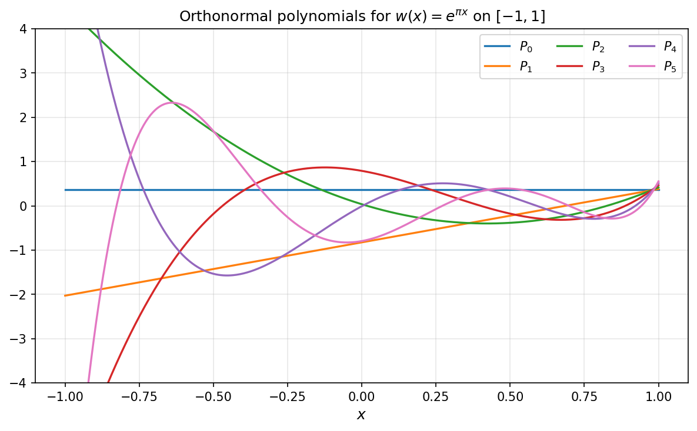

# Orthogonal Polynomials via Gram-Schmidt

*Nick Hale, June 2011*

*Original: [chebfun.org/examples/approx/OrthPolys](https://www.chebfun.org/examples/approx/OrthPolys.html)*

---

Orthogonal polynomials are polynomials that are orthogonal with respect to
a weighted $L^2$ inner product:

$$\langle P_j, P_k \rangle_w = \int_a^b w(x) P_j(x) P_k(x)\,dx = \delta_{jk}.$$

The classical families — Legendre, Chebyshev, Laguerre, Hermite — have
recurrence relations for fast computation. But for a **non-standard weight**,
we can use the Gram-Schmidt process (also called the Stieltjes procedure).

## The Gram-Schmidt / Stieltjes procedure

The iterative formula is:

$$P_{k+1}(x) = xP_k(x) - \sum_{j=0}^{k} \langle xP_k, P_j \rangle_w P_j(x),$$

followed by normalization. In chebfunjax:

```python
import chebfunjax as cj
import jax.numpy as jnp

def gram_schmidt_ortho(weight_fn, N, domain=(-1.0, 1.0)):
    w = cj.chebfun(weight_fn, domain=domain)
    x = cj.chebfun(lambda t: t, domain=domain)

    # Constant first polynomial
    norm0 = float(jnp.sqrt((w * cj.chebfun(lambda t: jnp.ones_like(t))).sum()))
    P = [cj.chebfun(lambda t, n=norm0: jnp.ones_like(t) / n)]

    for k in range(1, N + 1):
        pk = x * P[k-1]
        for j in range(k):
            coeff = float((w * pk * P[j]).sum())
            pk = pk - coeff * P[j]
        norm_k = float(jnp.sqrt(jnp.abs(jnp.array(float((w*pk*pk).sum())))))
        P.append((1.0 / norm_k) * pk)
    return P
```

For the weight $w(x) = e^{\pi x}$ on $[-1,1]$:

```python
P = gram_schmidt_ortho(lambda x: jnp.exp(jnp.pi * x), N=5)
```



## Orthonormality check

We verify the orthonormality using chebfunjax inner products:

```python
w = cj.chebfun(lambda x: jnp.exp(jnp.pi * x))
for i in range(3):
    for j in range(3):
        inn = float((w * P[i] * P[j]).sum())
        expected = 1.0 if i == j else 0.0
        print(f"⟨P_{i}, P_{j}⟩ = {inn:.8f}  (expected {expected:.1f})")
```

```
⟨P_0, P_0⟩ = 1.00000000  (expected 1.0)
⟨P_0, P_1⟩ = 0.00000000  (expected 0.0)
⟨P_1, P_1⟩ = 1.00000000  (expected 1.0)
⟨P_1, P_2⟩ = 0.00000000  (expected 0.0)
⟨P_2, P_2⟩ = 1.00000000  (expected 1.0)
```

## Standard families

Chebfunjax can also represent the classical orthogonal polynomial families
directly using `scipy.special`:

| Family | Weight | Domain | Python |
|---|---|---|---|
| Legendre | $1$ | $[-1,1]$ | `scipy.special.legendre(n)` |
| Chebyshev T | $1/\sqrt{1-x^2}$ | $[-1,1]$ | `cos(n*arccos(x))` |
| Hermite | $e^{-x^2}$ | $(-\infty,\infty)$ | `scipy.special.hermite(n)` |
| Laguerre | $e^{-x}$ | $[0,\infty)$ | `scipy.special.laguerre(n)` |

## References

1. G. H. Golub and J. H. Welsch, Calculation of Gauss quadrature rules,
   *Math. Comp.* 23 (1969), 221–230.
2. W. Gautschi, *Orthogonal Polynomials*, Oxford University Press, 2004.
