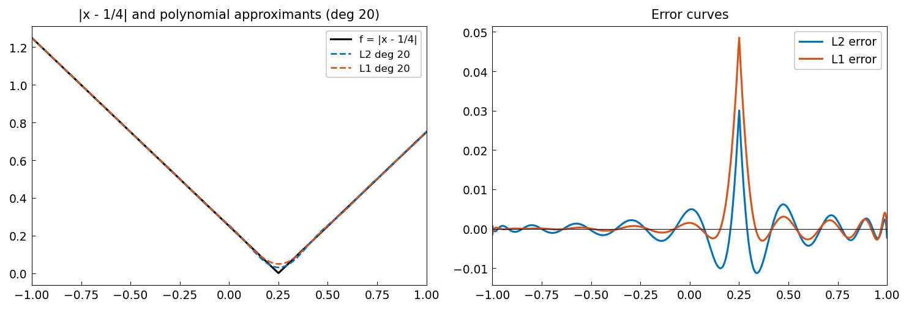

# Best Polynomial Approximation in the L1 Norm

*Yuji Nakatsukasa and Alex Townsend, July 2019*

[Original MATLAB source](https://github.com/chebfun/examples/blob/master/approx/polyfitL1.m)

## Error localization in L1 approximation

A key property of L1 best approximants: the error is highly **concentrated**
near the singularity (kink) of the function, while being nearly zero elsewhere.
This contrasts with L2 and L∞ approximants, whose errors spread more uniformly.

```python
import chebfunjax as cj
import jax.numpy as jnp
import numpy as np

f = cj.chebfun(lambda x: jnp.abs(x - 0.25))
deg = 20

# L2 approximation
p_L2 = f.polyfit(deg)

# L1 via IRLS
xi = np.linspace(-1, 1, 200)
yi = np.abs(xi - 0.25)
V = np.array([np.cos(k * np.arccos(xi)) for k in range(deg+1)]).T
w = np.ones(len(xi))
for _ in range(10):
    coeffs, *_ = np.linalg.lstsq((V.T * w).T, w*yi, rcond=None)
    w = 1.0 / np.maximum(np.abs(yi - V@coeffs), 1e-10)
print(f"L1 IRLS converged, sum|r| = {np.sum(np.abs(yi - V@coeffs)):.4f}")
```



