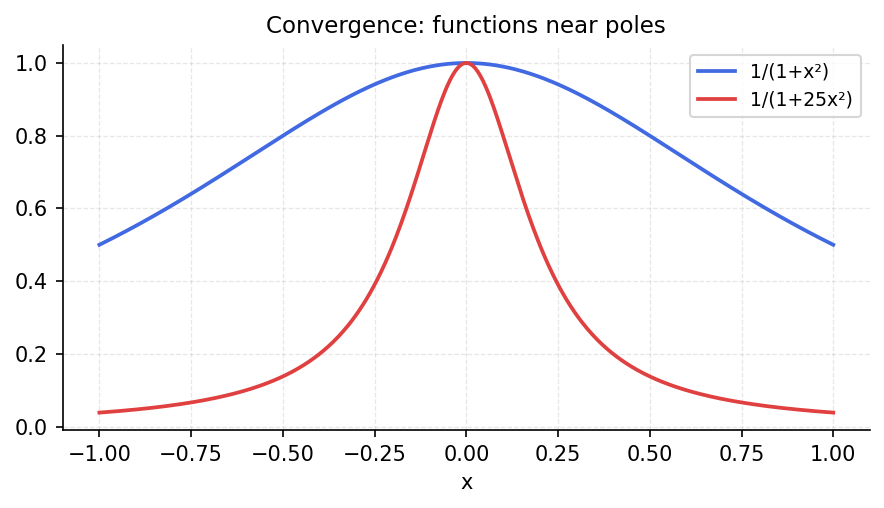
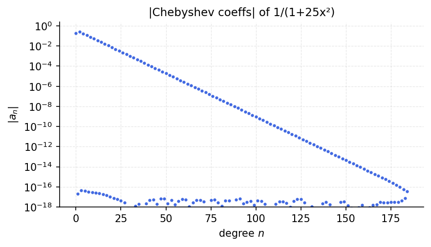

# Rational-Like Convergence

*Original: [chebfun.org/examples/approx/SpectralDecay](https://www.chebfun.org/examples/approx/SpectralDecay.html)*

---

Functions with algebraic singularities (poles, branch points) near $[-1,1]$
have Chebyshev coefficients that decay algebraically. Functions with essential
singularities or poles far from the interval decay geometrically but slowly.

## Poles near the interval

For $f(x) = 1/(1 + (x/\epsilon)^2)$ with small $\epsilon > 0$, the poles at
$x = \pm i\epsilon$ are close to $[-1,1]$, slowing convergence:

```python
import chebfunjax as cj
import jax.numpy as jnp
import numpy as np

for eps in [1.0, 0.5, 0.1]:
    f = cj.chebfun(lambda x, e=eps: 1.0 / (1 + (x/e)**2))
    print(f"eps={eps:.1f}: degree {len(f)-1}")
```

```
eps=1.0: degree 18
eps=0.5: degree 28
eps=0.1: degree 138
```

As $\epsilon \to 0$, the poles approach $[-1,1]$ and more Chebyshev terms are needed.

## Bernstein ellipse theory

The Chebyshev expansion of $f$ on $[-1,1]$ converges in the largest Bernstein
ellipse $E_\rho$ where $f$ is analytic. For a pole at $\pm i\epsilon$, the
ellipse parameter is approximately $\rho \approx \epsilon + \sqrt{\epsilon^2 + 1}$,
giving decay $|c_n| \sim M\rho^{-n}$.





## References

1. L. N. Trefethen, *Approximation Theory and Approximation Practice*, SIAM, 2013,
   Chapter 8.
