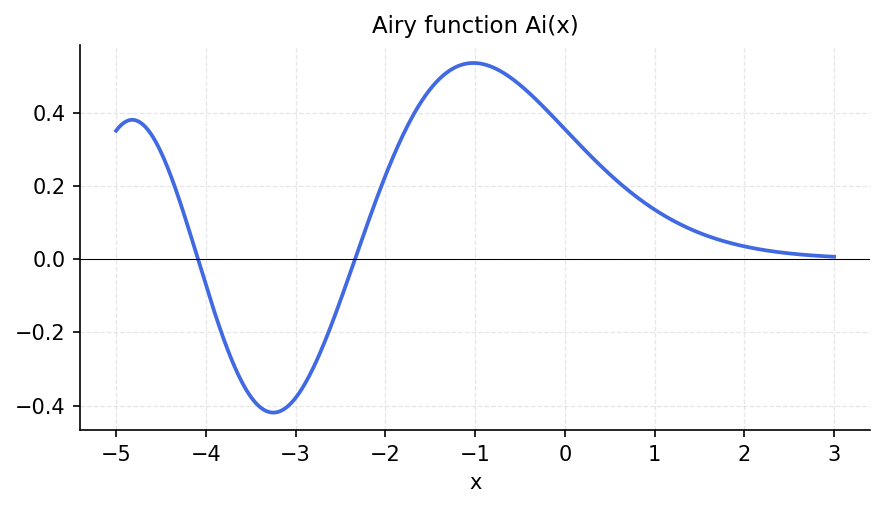
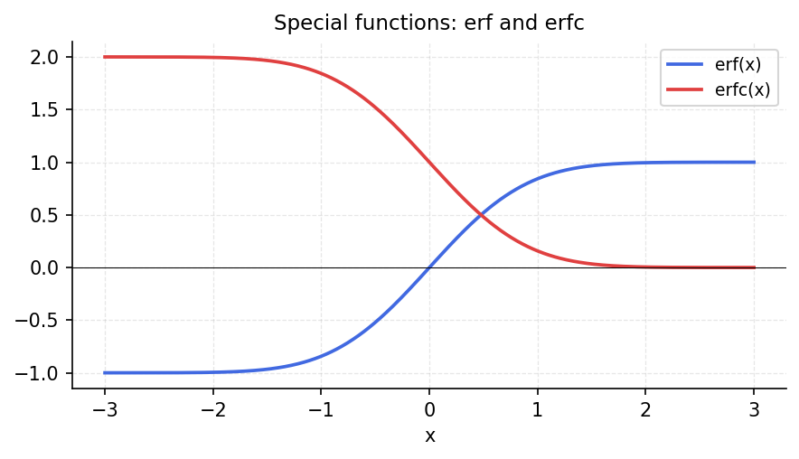

# Special Functions

*Original: [chebfun.org/examples/approx/SpecialFunctions](https://www.chebfun.org/examples/approx/SpecialFunctions.html)*

---

Chebfun can approximate special functions (Airy, Bessel, gamma, etc.) by
constructing Chebyshev interpolants via calls to scipy or other libraries.
The resulting chebfuns are fast to evaluate and have all Chebfun capabilities
(integration, differentiation, roots).

## Airy function

The Airy function $\text{Ai}(x)$ satisfies $y'' = xy$ and decays to zero
as $x \to +\infty$:

```python
import chebfunjax as cj
import jax.numpy as jnp
import scipy.special
import numpy as np

Ai = cj.chebfun(
    lambda x: jnp.array(scipy.special.airy(np.array(x))[0]),
    domain=(-5.0, 5.0)
)
print(f"Ai(x) on [-5,5]: degree {len(Ai)-1}")

# Roots of Ai(x) = 0
roots = np.sort(np.array(Ai.roots()))
print(f"First 5 roots: {roots[:5]}")
```



## Error function

The error function $\text{erf}(x) = \frac{2}{\sqrt{\pi}}\int_0^x e^{-t^2}dt$
can be approximated by chebfun directly from its definition:

```python
erf_cheb = cj.chebfun(
    lambda x: jnp.array(scipy.special.erf(np.array(x))),
    domain=(-3.0, 3.0)
)
# Verify integral property: erf(x) = (2/sqrt(pi)) * cumsum(exp(-x^2))
gauss = cj.chebfun(lambda x: jnp.exp(-x**2), domain=(-3.0, 3.0))
integral = float(gauss.sum()) * 2 / float(jnp.sqrt(jnp.pi))
print(f"∫₋₃³ exp(-x²) dx * 2/√π = {integral:.8f}")
print(f"erf(3) - erf(-3) = {float(erf_cheb(jnp.array(3.0))) - float(erf_cheb(jnp.array(-3.0))):.8f}")
```


