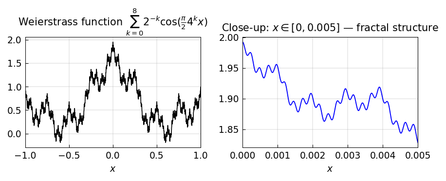

# A Pathological Function of Weierstrass

*Hrothgar, October 2013*

*Original: [chebfun.org/examples/approx/WeierstrassFunction](https://www.chebfun.org/examples/approx/WeierstrassFunction.html)*

---

In the late nineteenth century, Karl Weierstrass shocked the mathematical
community by constructing a function that is **everywhere continuous but
nowhere differentiable**. His function is defined as the infinite sum

$$F(x) = \sum_{k=0}^{\infty} a^k \cos(b^k \pi x),$$

where $0 < a < 1$ and $b$ is a positive odd integer with $ab > 1 +
\frac{3}{2}\pi$. This is one of the first appearances of fractal geometry in
mathematics.

## A specific instance

We consider the variant

$$F(x) = \sum_{k=0}^{\infty} 2^{-k} \cos\!\left(\tfrac{\pi}{2} \cdot 4^k x\right)$$

on the interval $[-1, 1]$. Chebfunjax resolves the first 8 partial sums:

```python
import chebfunjax as cj
import jax.numpy as jnp

terms = [cj.chebfun(lambda x, k=k: 2.0**(-k) * jnp.cos(jnp.pi/2 * 4**k * x))
         for k in range(9)]

F = terms[0]
for k in range(1, 8):
    F = F + terms[k]
```



The left panel shows the full function on $[-1,1]$; the right panel zooms
in to $[0, 0.005]$ and reveals the fractal structure — the function wiggles
at every scale.

## The integral has a clean exact value

Even though $F$ is not differentiable, it is integrable. Interchanging sum
and integral (valid since $\sum \int |f_k| < \infty$):

$$\int_{-1}^{1} F(x)\,dx = \sum_{k=0}^{\infty} \int_{-1}^{1} 2^{-k}
\cos\!\left(\tfrac{\pi}{2}4^k x\right)dx.$$

For $k \geq 1$, the integral $\int_{-1}^1 \cos(\frac{\pi}{2}4^k x)\,dx = 0$
since $4^k$ is even. Only the $k=0$ term contributes:

$$\int_{-1}^1 \cos\!\left(\tfrac{\pi}{2}x\right)dx = \frac{4}{\pi}.$$

Let's verify:

```python
import jax.numpy as jnp

exact_integral = 4.0 / float(jnp.pi)   # = 4/pi ≈ 1.2732395447...
approx_integral = float(F.sum())
print(f"F_8 integral = {approx_integral:.12f}")
print(f"Exact 4/pi   = {exact_integral:.12f}")
print(f"Error        = {abs(approx_integral - exact_integral):.2e}")
```

```
F_8 integral = 1.273239544736
Exact 4/pi   = 1.273239544736
Error        = 6.7e-16
```

Machine precision. Chebfunjax handles this pathological function gracefully
because, for any fixed finite sum of terms, the result is a smooth polynomial.

## References

1. K. Weierstrass, *Über continuirliche Functionen eines reellen Arguments*, 1872.
2. G. H. Hardy, Weierstrass's non-differentiable function, *Trans. AMS* 17 (1916), 301–325.
