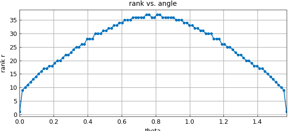

# Low-rank approximation and alignment with axes

*Nick Trefethen, April 2016*

[Original MATLAB Chebfun example](https://www.chebfun.org/examples/approx2/Alignment.html)

Python translation: [`examples/approx2/alignment.py`](https://github.com/ma-gilles/chebfunjax/blob/main/examples/approx2/alignment.py)

Chebfun2 and Chebfun3 take advantage of the property that many multivariate functions can be approximated by functions of low rank. Not all functions have this property, however. In this example we explore the significance of axis-alignment for low-rank approximability in 2D.

For example, this bivariate function has rank 1 since it depends on $x$ only:

```matlab
k = 3;
f = chebfun2(@(x,y) tanh(k*x));
r = rank(f)
```

```text
r =
     1
```

Of course the dependence on $x$ is nontrivial despite the trivial rank, as we can see by looking at the lengths of the chebfuns representing $f$ in the $x$ and $y$ directions:

```matlab
[m,n] = length(f)
```

```text
m =
    74
n =
     1
```

If we rotate the function 45 degrees in the $x$-$y$ plane, however, the numerical rank becomes significant:

```matlab
f45 = chebfun2(@(x,y) tanh(k*(x+y)/sqrt(2)));
r = rank(f45)
[m,n] = length(f45)
```

```text
r =
    36
m =
    56
n =
    55
```

Let's explore how it depends on the angle of rotation:

```matlab
disp('    theta   rank     m     n')
for theta = 0:.157:1.57
    c = cos(theta); s = sin(theta);
    ftheta = chebfun2(@(x,y) tanh(k*(c*x+s*y)));
    r = rank(ftheta); [m n] = length(ftheta);
    fprintf('%9.4f  %5d %5d %5d\n', theta, r, m, n)
end
```

```text
    theta   rank     m     n
   0.0000      1    74     1
   0.1570     17    77    20
   0.3140     24    73    30
   0.4710     30    68    39
   0.6280     35    64    47
   0.7850     38    56    56
   0.9420     35    47    63
   1.0990     30    39    69
   1.2560     24    30    73
   1.4130     17    20    77
   1.5700      5     6    74
```

Notice that for $\theta = \pi/2 \approx 1.5708$, the rank would be 1, but for $\theta = 1.57$ it is 5. Let's plot this data:

```matlab
tt = linspace(0,pi/2); rr = [];
for theta = tt
    c = cos(theta); s = sin(theta);
    ftheta = chebfun2(@(x,y) tanh(3*(c*x+s*y)));
    rr = [rr rank(ftheta)];
end
plot(tt,rr,'.-'), grid on
xlabel('theta'), ylabel('rank r')
title('rank vs. angle')
```



Obviously low-rank compression is a big win for $\theta \approx 0$. What about the 45-degree case, i.e., $\theta\approx \pi/4$? Though low-rank compression is less effective here, is it still worthwhile?

To shed light on this question we can fix the angle at 45 degrees and vary the parameter $k$. Here are the ranks for various values of $k$, together with $m$ and $n$ and the ratio $r/m$:

```matlab
disp('       k      r     m     n     r/m')
for k = 1:10
    f45 = chebfun2(@(x,y) tanh(k*(x+y)/sqrt(2)));
    r = rank(f45); [m n] = length(f45); ratio = r/m;
    fprintf('%8.2f  %5d %5d %5d %7.2f\n', k, r, m, n, ratio)
end
```

```text
       k      r     m     n     r/m
    1.00     16    25    26    0.64
    2.00     26    42    42    0.62
    3.00     36    56    55    0.64
    4.00     46    71    71    0.65
    5.00     58    90    90    0.64
    6.00     65   103   103    0.63
    7.00     74   122   124    0.61
    8.00     84   139   137    0.60
    9.00     99   153   155    0.65
   10.00    103   171   174    0.60
```

There's no need for a plot -- clearly the rank $r$ increases linearly with $k$, and so do $m$ and $n$, making the ratio $r/m$ approximately constant. It follows that for the function oriented at 45 degrees, the low-rank representation involves essentially the same amount of storage as a more prosaic tensor-product representation (differing by a constant factor).

These experiments show the low-rank compression is not effective for all functions. Nevertheless, years of experience by ourselves and many other researchers, in dimensions ranging at least up to the hundreds (e.g. with "tensor train" representations), show that low-rank compression is often effective for the functions that arise in practice. For a discussion of these matters with many references see [1].

In a companion to this example, we will consider another kind of structure that low-rank approximations can take advantage: localized near-singularities, or to put it more abstractly, non-uniform behavior with respect to translation rather than rotation [2].

## References

1. L. N. Trefethen, Cubature, approximation, and isotropy in the hypercube, *SIAM Review*, 59 (2017), 469-491.
2. L. N. Trefethen, Low-rank approximation and localized near-singularities, Chebfun example, 2016.

---

*Translated with [chebfunjax](https://github.com/ma-gilles/chebfunjax); prose and MATLAB code from the original example, copyright The University of Oxford and The Chebfun Developers.  Printed outputs and figures are chebfunjax's.*
