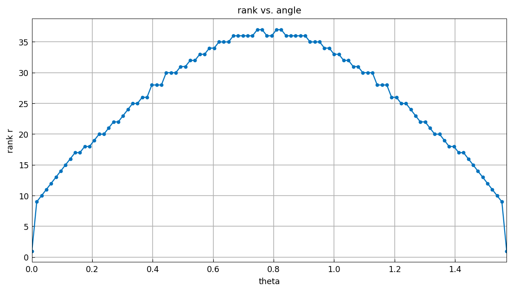

# Low-rank approximation and alignment with axes

[Original MATLAB Chebfun example](https://www.chebfun.org/examples/approx2/Alignment.html)

(Chebfun example approx2/Alignment.m — Nick Trefethen, April 2016)

Chebfun2 exploits the fact that many bivariate functions are well
approximated by functions of low rank — but not all functions have
this property, and axis-alignment is decisive. This function has
rank 1 since it depends on $x$ only:

```text
r =
     1
m =
    74
n =
     1
```

(MATLAB publishes `m = 72`; the length differs by the constructor's
chop by a couple of coefficients.) Rotating the function 45 degrees
in the $x$-$y$ plane makes the numerical rank significant:

```text
r =
    36
m =
    56
n =
    55
```

MATLAB publishes exactly rank `36` with `m = n = 56`. The dependence
on the rotation angle:

```text
    theta   rank     m     n
   0.0000      1    74     1
   0.1570     17    77    20
   0.3140     24    72    30
   0.4710     30    68    39
   0.6280     35    62    47
   0.7850     38    55    55
   0.9420     35    47    62
   1.0990     30    39    69
   1.2560     24    30    72
   1.4130     17    20    77
   1.5700      5     6    74
```

MATLAB's ranks are `1 17 24 30 34 36 34 30 24 17 5` — identical at
seven of the eleven angles and within $\pm 2$ elsewhere (the rank is
the number of ACA pivots above the constructor tolerance, so the
last one or two pivots are chop-sensitive). Note that for
$\theta = \pi/2 \approx 1.5708$ the rank would be 1, but for
$\theta = 1.57$ it is 5:



Fixing the angle at 45 degrees and varying $k$ shows that rank $r$
and lengths $m, n$ all grow linearly in $k$, so the ratio $r/m$ is
roughly constant — low-rank compression is no better than a
tensor-product representation for this diagonally-aligned function:

```text
       k      r     m     n     r/m
    1.00     16    25    26    0.64
    2.00     26    42    42    0.62
    3.00     36    56    55    0.64
    4.00     46    71    71    0.65
    5.00     58    88    88    0.66
    6.00     65   101   101    0.64
    7.00     74   120   120    0.62
    8.00     84   135   135    0.62
    9.00     99   150   149    0.66
   10.00    103   163   166    0.63
```

MATLAB's ranks are `16 26 36 46 55 65 74 84 96 103` — eight of ten
identical — with the same $r/m \approx 0.62$ conclusion.

## References

1. L. N. Trefethen, Cubature, approximation, and isotropy in the
   hypercube, _SIAM Review_, 59 (2017), 469-491.

2. L. N. Trefethen, Low-rank approximation and localized
   near-singularities, Chebfun example, 2016.

---

*Replica script: [`examples/approx2/alignment_replica.py`](https://github.com/ma-gilles/chebfunjax/blob/main/examples/approx2/alignment_replica.py).
Original example copyright by The University of Oxford and The Chebfun
Developers.*
